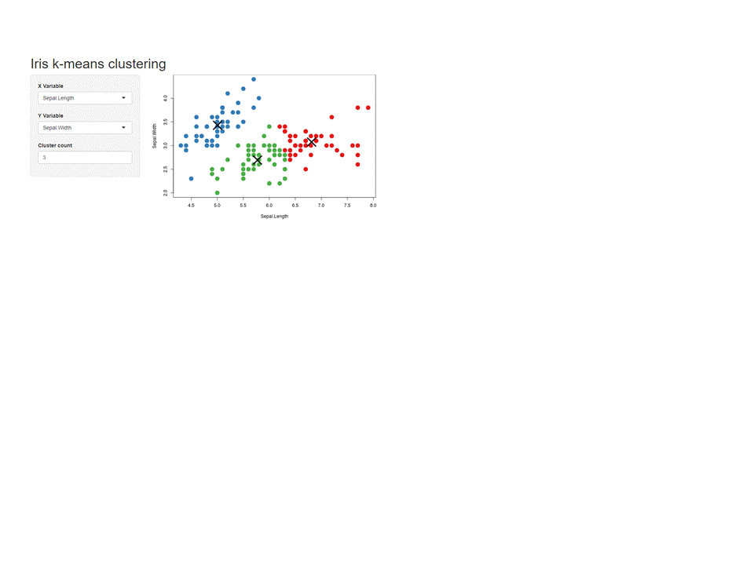

```{r setup, include=FALSE}
library(flipbookr)
options(htmltools.dir.version = FALSE)
xaringanExtra::use_scribble(pen_color = "#B7410E")  # press S
xaringanExtra::use_tile_view()                      # press O
xaringanExtra::use_webcam()                         # press W
xaringanExtra::use_animate_all("fade")
xaringanExtra::use_freezeframe() # for GIFs!
xaringanExtra::use_progress_bar(color = "red", location = "bottom", height = "10px")
```


```{r, child="readme.md"}
```

---

class: center, middle, inverse

# Layouts

---

# Tipos de Layouts

Laytous se refiere a la disposición de elementos -como inputs, textos,
outputs- en nuestra app. 

Dependiendo de las necesidaes puede ser convenientes algunos
tipos de layuts sobre otros

.center[
```{r, out.width = "800px", echo=FALSE}

```
]


---

# sidebarLayout

<br/>


---

# sidebarLayout: Estructura

Es una distribución simple donde lo primero en aparecer es los controles o
inputs.

Luego viene el panel principal el cual posee mayor espacio.


.center[
```{r, out.width = "800px", echo=FALSE}
knitr::include_graphics("imgs/sidebar2.png")
```
]

---

# sidebarLayout: Ejemplo código

```r
library(shiny)

ui <- fluidPage(
  titlePanel("Hello Shiny!"),
  sidebarLayout(
    sidebarPanel(
      sliderInput("obs", "Number of observations:", min = 0, max = 1000, value = 500)
    ),
    mainPanel(plotOutput("distPlot"))
  )
)

server <- function(input, output) {
  output$distPlot <- renderPlot({ hist(rnorm(input$obs)) })
}

shinyApp(ui, server)
```

---

class: center, middle, inverse

# Paneles de Navegación

---

# Tipos de Paneles de Navegación

Es posible que nuestra aplicación vaya creciendo, en dicho caso, Los paneles 
nos permiten organizar distintas secciones de la aplicación.

.center[
```{r, out.width = "800px", echo=FALSE}
knitr::include_graphics("imgs/navlayouts.png")
```
]

---

# tabsetPanel

Los tabs (`tabsetPanel`) son útiles para separar secciones _similares_ en nuestra app. A diferencia de por ejemplo `navbarPage`.

.code70[
```{r, eval=FALSE}
library(shiny)

ui <- fluidPage(
  titlePanel("Hello Shiny!"),
  sidebarLayout(
    sidebarPanel(
      sliderInput("obs", "Number of observations:", min = 0, max = 1000, value = 500)
    ),
    mainPanel(
      tabsetPanel(
        tabPanel("Plot", plotOutput("plot")),
        tabPanel("Summary", verbatimTextOutput("summary")),
        tabPanel("Table", tableOutput("tabla"))
      )
    )
  )
)

server <- function(input, output) {
  output$plot <- renderPlot({ hist(rnorm(input$obs)) })
  output$summary <- renderText({ input$obs })
  output$tabla <- renderTable({ data.frame(input$obs) })
}

shinyApp(ui, server)
```
]

---

# tabsetPanel

Los tabs (`tabsetPanel`) son útiles para separar secciones _similares_ en nuestra app. A diferencia de por ejemplo `navbarPage`.


---

# Ejercicio: Modificar la estructura de la aplicación

<br/>

Nivel _fácil, para calentar las manos_: Para el ejemplo de `sidebarLayout`: Modifique la aplicación para que posea un layout de tipo `flowLayout`.

<br/>

Nivel _entretenido_: Para el ejemplo de `tabsetPanel` agregue:
  - Un tab más con un gráfico de líneas.
  - Un tab que utilice la función `summary` para mostra resúmen de los datos.
  - Restruture la applicación para utilizar la función `navbarPage` y que
  dentro de las seccione sea el contenido inicial del ejemplo.

---

# Solucion 1

---

# Solucion 2


---

class: center, middle, inverse

# HTMLWidgets

---

# HTMLWidgets

HTMLWidgets son un tipo de paquetes que nos permiten realizar visualizaciones en HTML
las cuales se pueden usar en (1) consola, (integrar) integrar con shiny y también (3) rmarkdown.

Existen una gran cantida de paquetes https://gallery.htmlwidgets.org/, y nos sirven 
para complementar nuestra aplicación. 

Cada paquete HTMLWidget tiene su propio set de funciones, el código utilizado  para hacer un gráfico en plotly no es el mismo (pero generalmente muy similar)
al utilizado en highcharter, echarts4r:

- https://plotly.com/r/
- https://jkunst.com/highcharter/
- https://echarts4r.john-coene.com/
- https://rstudio.github.io/leaflet/
- https://rstudio.github.io/DT/

Ejemplo de uso de script https://github.com/jbkunst/shiny-visualizacion-de-datos-con-R/blob/master/R/script-htmlwidgets.R 

---

`r flipbookr::chunk_reveal("ggplot2", title = "# Antes de Plotly, ggplot2️", widths = c(2,3), chunk_options = "warnings = FALSE, message=FALSE")`

```{r ggplot2, include = FALSE}
library(ggplot2)

data(iris)

ggplot(iris, aes(Sepal.Length, Sepal.Width)) +
  geom_point() +
  geom_smooth(method = "lm") + 
  facet_wrap(vars(Species)) +
  theme_minimal()
```


---

`r flipbookr::chunk_reveal("plotly", title = "# Plotly️", widths  =c(2,3), chunk_options = "warnings = FALSE, message=FALSE")`

```{r plotly, include = FALSE}
library(ggplot2)
library(plotly)

data(iris)

p <- ggplot(iris, aes(Sepal.Length, Sepal.Width)) +
  geom_point() +
  geom_smooth(method = "lm") + 
  facet_wrap(vars(Species)) +
  theme_minimal()

ggplotly(p)
```

---

`r flipbookr::chunk_reveal("highcharter", title = "# highcharter️", widths = c(2,3), chunk_options = "warnings = FALSE, message=FALSE")`

```{r highcharter, include = FALSE}
library(highcharter)
library(forecast)

data("AirPassengers")

modelo <- forecast(auto.arima(AirPassengers))

hchart(modelo) |> 
  hc_add_theme(hc_theme_hcrt()) |> 
  hc_navigator(enabled = TRUE) |> 
  hc_rangeSelector(enabled = TRUE) |> 
  hc_title(text = "Proyección")
```

---

`r flipbookr::chunk_reveal("sismos", title = "# Antes de seguir, descarguemos datos!", widths =c(1,3), chunk_options = "warnings = FALSE, message=FALSE")`

```{r sismos, include = FALSE}
library(rvest)   # descargar datos de paginas web

url <- "https://www.sismologia.cl/sismicidad/catalogo/2022/07/20220721.html"

read_html(url) |> 
  html_table() |> 
  dplyr::nth(2) |> 
  janitor::clean_names() |> 
  tidyr::separate(
    latitud_longitud, 
    into = c("latitud", "longitud"), 
    sep = " ", convert = TRUE
    ) 

datos <- read_html(url) |> 
  html_table() |> 
  dplyr::nth(2) |> 
  janitor::clean_names() |> 
  tidyr::separate(
    latitud_longitud, 
    into = c("latitud", "longitud"), 
    sep = " ", convert = TRUE
    )
```

---

`r flipbookr::chunk_reveal("dt", title = "# DT", widths = c(2, 3), chunk_options = "warnings = FALSE, message=FALSE")`

```{r dt, include = FALSE}
library(DT)

datatable(datos)
```

---

`r flipbookr::chunk_reveal("leaflet", title = "# Leaflet", widths = c(2, 3), chunk_options = "warnings = FALSE, message=FALSE")`

```{r leaflet, include = FALSE}
library(leaflet)

leaflet(datos) |>
  addTiles() |>  
  addMarkers(
    lng = ~longitud, 
    lat = ~latitud,
    popup = ~as.character(magnitud_2),
    label = ~as.character(`fecha_local_lugar`)
    ) |> 
  addProviderTiles("Esri.WorldImagery")
```

---

# Pero como usar HTMLWidgets en nuestra App?

<br>

Cada uno de los HTMLWidgets presentados, en su documentación detallan 
como usarlos en una aplicación shiny.

De forma general en cada paquete existirá una función tipo:

- `*Output` para colocarla en el `ui`.
- `render*` para definirla en el `server`

A modo de ejemplo, el paquete `leaflet` tiene `leafletOutput()` y `renderLeaflet()`.

Los anterior está documentado en https://rstudio.github.io/leaflet/shiny.html.


---

# Ejercicio: Agregar algunos HTMLWidgets a nuestra app.

<br/>

A la aplicación obtenida de modificar la de `tabsetPanel` (Nivel _entretenido_),
modificar gráficos y tablas para incluir algunos HTMLWidgets.

---

# Solución

---

# Ejercicio grupal: Juntando inputs y htmlwidgets

<br> 

Generar una aplicación que considere los datos
de los últimos sismos y que contenga:

- Un widget de tabla con DT.
- Un mapa con leaflet graficando el lugar de los 
sismos.
- Un slider con el fin de filtrar información.

<br> 

Hint: Leer documentación!

<br> 

Posible solucion en https://github.com/datosuc/Visualizacion-de-datos-con-R/blob/master/apps/htmlwidgets/app.R


---

# Ejercicio: Transformando script R en una App

<br>

Muy común es que dado un código o proceso que hemos programado, lo necesitaremos
migrar a una shiny app o documento rmarkdown. 


Entonces:

<br>

- Inspeccionar, ejecutar y modificar el script https://github.com/datosuc/Visualizacion-de-datos-con-R/blob/master/R/script-exportaciones.R (la siguiente slide tambien lo tiene).
- Generar una app que tenga como input una lista de países y
muestre el forecast de las exportaciones de dicho país.
- Luego utilizar algn HTMLWidget para complementar la aplicación.

Posible solución en https://github.com/jbkunst/shiny-visualizacion-de-datos-con-R/blob/main/apps/exportaciones/app.R

---

# Código

.code60[
```{r, eval=FALSE}
if(!require(forecast)) install.packages("forecast")
if(!require(xts))      install.packages("xts")
if(!require(ggplot2))  install.packages("ggplot2")
if(!require(dplyr))    install.packages("dplyr")
if(!require(remotes))  install.packages("remotes")
if(!require(tradestatistics))  remotes::install_github("ropensci/tradestatistics")

library(forecast) # forecast autoplot
library(xts) # xts
library(tradestatistics) # ots_create_tidy_data 
library(ggplot2) # autoplot
library(dplyr) # glimpse |> group_by summarise

pais <- "can"  # seteo pais, usa, can

data <- ots_create_tidy_data(years = 2002:2019, reporters = pais, table = "yrp")

glimpse(data)

data <- data |> 
  group_by(year, reporter_iso) |> 
  summarise(exportaciones = sum(trade_value_usd_exp))

valores <- data$exportaciones

fechas <- as.Date(paste0(data$year, "0101"), format = "%Y%m%d")

serie <- xts(valores, order.by = fechas) # creo la serie de tiempo para la fucion forecast

prediccion <- forecast(serie, h = 5) # realizo automágicamente una predicción

autoplot(prediccion)
```
]


---

class: center, middle, inverse

# Temas & Estilos

---

# Temas & Estilos

- Al principio todas nuestras app son similares.
- Existen extensiones/paquetes que permiten cambiar el estilo/look de la aplicación.




---

# shinythemes

Los más fácil de implementar, sin tan alto impacto en código ni imagen. Opciones en http://bootswatch.com/

https://rstudio.github.io/shinythemes/


---

# shinythemes

Antes:

```r
library(shiny)

ui <- fluidPage(
   sidebarLayout(...
```

Ahora:

```r
library(shiny)
library(shinythemes)

ui <- fluidPage(
   theme = shinytheme("superhero"),
   sidebarLayout(...
```

**NOTAR** que este cambio es solo en la parte ui. La parte del server no cambia.

---

# shinydashboard

Orientados a __dashboards__<span class="fragment"> agrega más funcionalidades</span>


---

# shinydashboard

```r
library(shinydashboard)

ui <- dashboardPage(
  dashboardHeader(),
  dashboardSidebar(
     sliderInput("valor", label = "Valor", min = 1, max = 10, value = 1)
  ),
  dashboardBody(
    fluidRow(box(width = 12, plotOutput("grafico")))
  )
)
```

---

# Más y más templates y diseños

<br/>

Existen muchos paquetes para cambiar estilos/css.

- shinydashboardPlus: https://rinterface.com/shiny/shinydashboardPlus/
- bs4Dash: https://rinterface.com/shiny/bs4Dash/classic/
- miniUI2Demo: https://dgranjon.shinyapps.io/miniUI2Demo
- tablerDash: https://rinterface.com/shiny/tablerDash/

Notar que estos paquetes cambian solos el diseño de la interfaz, como textos,
colores, o botones, pero los gráficos quedan intactos. Existe  https://rstudio.github.io/thematic/index.html. 

---

# Ejercicio: Aplicar temas

- Tomar la última app de y probar por al menos 2 temas (recomiendo *paper*) de `shinythemes`:
- Modifcar el ui utilizando el ejemplo de `shinydashboard` (copy+paste).

```r
library(shiny)

ui <- fluidPage(
  sliderInput("valor", label = "Valor", min = 1, max = 10, value = 1),
  plotOutput("grafico")
  )

server <- function(input, output) {
  output$grafico <- renderPlot({ 
    plot(rnorm(input$valor), type = "l")
  })
}

shinyApp(ui, server)
```
