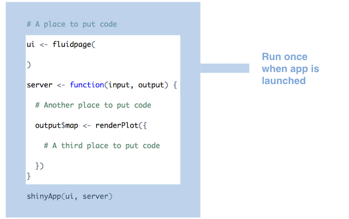

```{r setup, include=FALSE}
source("R/setup-xaringan.R")
```


```{r, child="readme.md"}
```

---

class: center, middle, inverse

# Orden de ejecución

---

# Una vez 

.center[
```{r echo = FALSE, out.width = "70%" }

```
]

---

# Una vez por usuario

.center[
```{r echo = FALSE, out.width = "70%" }
knitr::include_graphics("imgs/run-once-per-user.png")
```
]

---

# Muchas veces

.center[
```{r echo = FALSE, out.width = "70%" }
knitr::include_graphics("imgs/run-many-times.png")
```
]


---

class: center, middle, inverse

# Optimizando código

---

# Optimizando código

Tomemos el ejemplo anterior de graficar y consideremos una opción para mostrar
el eje en escala logaritmica


.code60[
```r
library(shiny) # fluidPage titlePanel sidebarLayout sidebarPanel selectInput checkboxInput mainPanel shinyApp
library(forecast) # forecast %>%
library(xts) # xts
library(tradestatistics) # ots_create_tidy_data
library(dplyr) # %>% mutate
library(ggplot2) # ggplot geom_line aes geom_ribbon scale_y_continuous labs scale_y_log10
library(scales) # comma
library(plotly) # plotlyOutput renderPlotly ggplotly 
library(shinythemes) # shinytheme

formatear_monto <- function(monto){
    paste("$", comma(monto/1e6, accuracy = .01), "MM")
}

lista_paises <- setNames(ots_countries$country_iso, ots_countries$country_name_english)

ui <- fluidPage(
    theme = shinytheme("cyborg"), 
    titlePanel("Ahora si que sí"),
    sidebarLayout(
        sidebarPanel(
            selectInput("pais", "Seleccionar un país:", choices = lista_paises, selected = "chl"),
            checkboxInput("log", label = "Escala en log")    #<<
        ),
        mainPanel(
          plotlyOutput("grafico")
        )
    )
)
```
]


---

# Optimizando código (cont.)


.code60[
```r
server <- function(input, output) {
    output$grafico <- renderPlotly({
        pais <- input$pais
        data <- ots_create_tidy_data(years = 1990:2018, reporters = pais, table = "yr")
        data <- mutate(data, year = as.numeric(year))
        valores <- data$trade_value_usd_exp
        fechas <- as.Date(paste0(data$year, "0101"), format = "%Y%m%d",)
        serie <- xts(valores, order.by = fechas) 
        prediccion <- forecast(serie, h = 5) 
        dfpred <- as.data.frame(prediccion)
        dfpred <- dfpred %>% mutate(anio = 2018 + 1:5)
        
        plt <- ggplot(data) +
          geom_line(aes(x = year, y = trade_value_usd_exp)) +
          geom_line(aes(x = anio, y = `Point Forecast`), data = dfpred, color = "darkred", size  = 1.2) +
          geom_ribbon(aes(x = anio, ymin = `Lo 95`, ymax = `Hi 95`), data = dfpred, alpha = 0.25) +\
          scale_y_continuous(labels = formatear_monto) +
          labs(x = "Año", y = NULL, title = pais, subtitle = "Acá va un subtitulo",
                caption = "Datos provenientes del paquete {tradestatistics}.")
        
        if(input$log){                    #<<
          plt <- plt + scale_y_log10()    #<<
        }
        
        ggplotly(plt)
      
    })
    
}

shinyApp(ui = ui, server = server)
```
]


---

# Expresiones reactivas (_reactive expressions_)

La idea de expresiones reactiva es que podemos limitar que es lo que se (re)ejecuta
al cambiar un input.

Una expresión reactiva es código R que usa un widget/input y retorna un valor, 
la expresion se actualizará cuando el valor del (de los) widgets cambien.

Se crea una expresion con la función `reactive` la que toma una expresión/código R
entre `{}`, de la misma forma que las funciones `render` (`renderPlot`, `renderTable`)

Así, por ejemplo ejemplo, para evitar correr código si solamente queremos cambiar
elementos del gráfico una solución usando expresiones reactivas sería.

.code60[
```r

server <- function(input, output) {
  
    dataExport <- reactive({
      
      pais <- input$pais
      data <- ots_create_tidy_data(years = 1990:2018, reporters = pais, table = "yr")
      data
      
    })
    
    output$grafico <- renderPlotly({
        
        data <- dataExport()
        
    
    output

```
]

---

# Expresiones reactivas (_reactive expressions_) (cont.)

Recordar que no necesariamente se puedes utilizar en **una** expresion, por ejemplo
si queremos usar el data frame para realizar una tabla podríamos hacer:

.code60[
```r

server <- function(input, output) {
  
    dataExport <- reactive({
      
      pais <- input$pais
      data <- ots_create_tidy_data(years = 1990:2018, reporters = pais, table = "yr")
      data
      
    })
    
    output$tabla <- renderTable({ dataExport()  })
    
    output$grafico <- renderPlotly({
        
        data <- dataExport()
        
    
    output

```
]

Pueden revisar el código en:

- https://github.com/datosuc/Visualizacion-de-datos-con-R/blob/master/apps/exportaciones/app-reactive-expression.R


