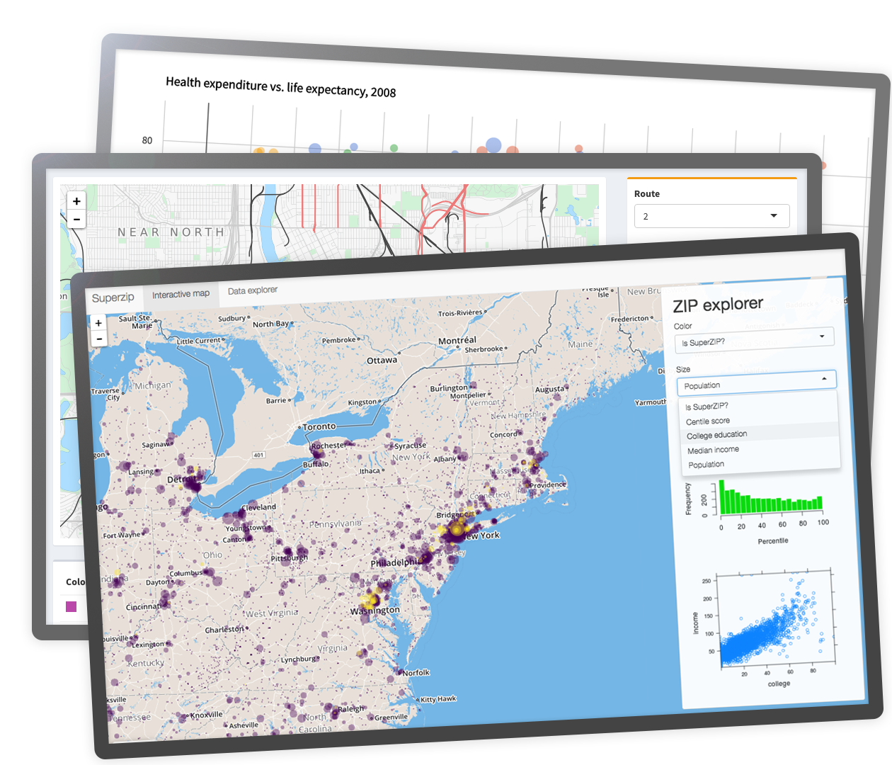
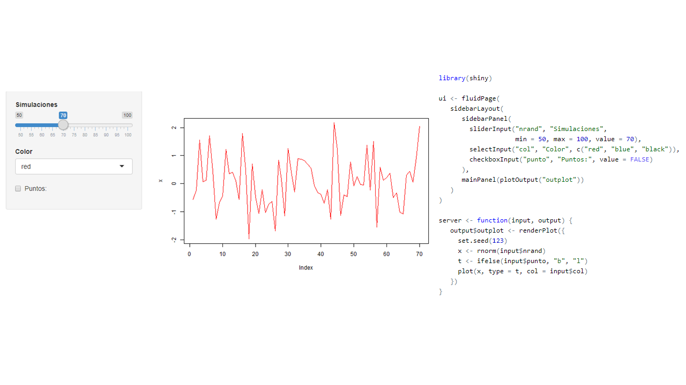
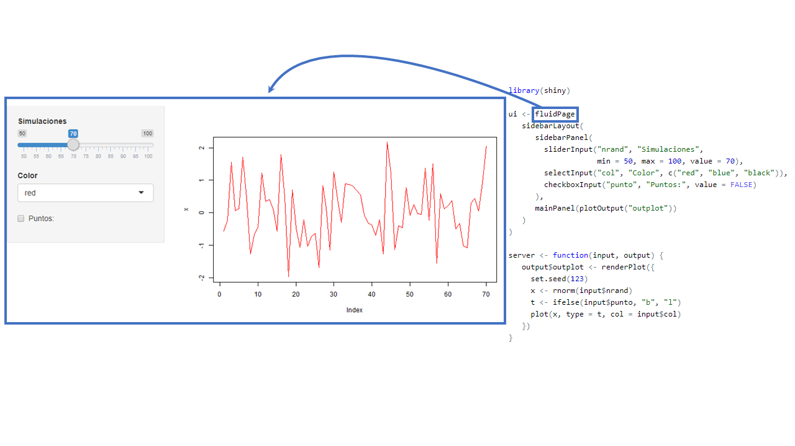
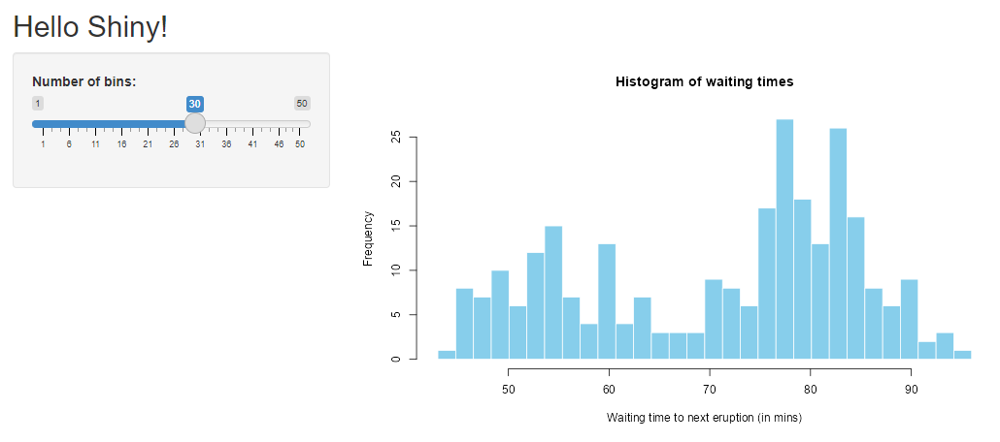
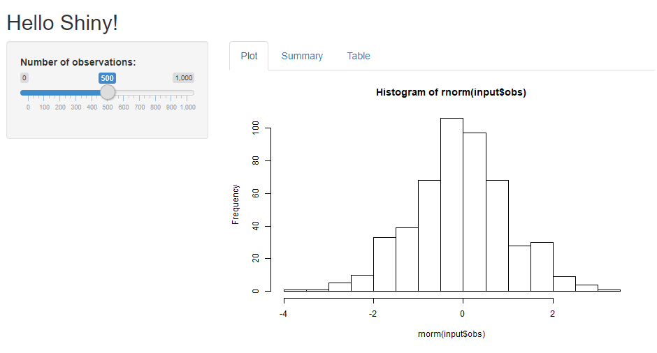
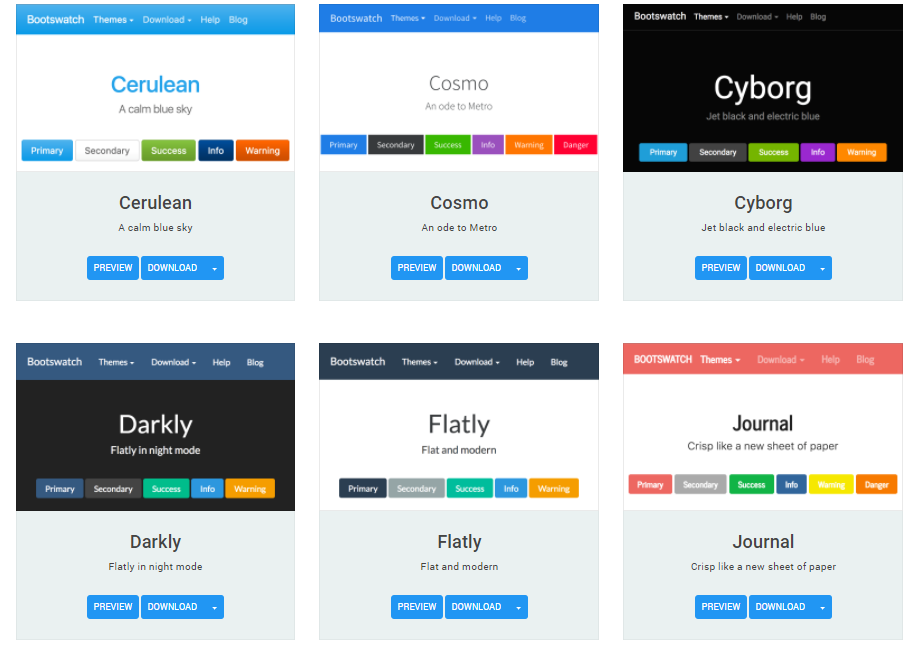
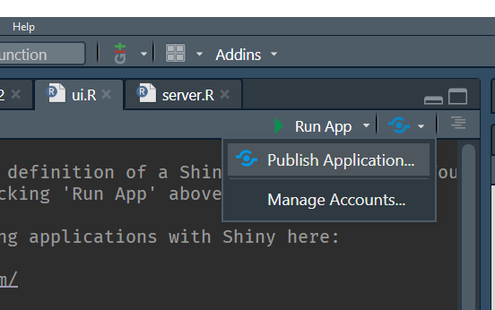
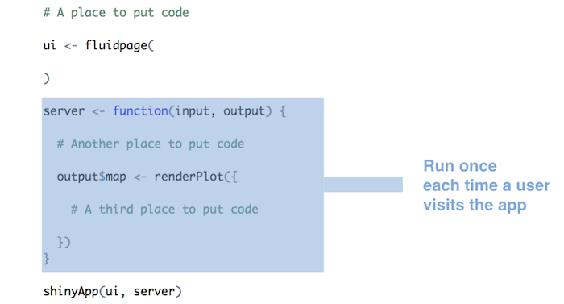

```{r setup, include=FALSE}
options(htmltools.dir.version = FALSE)
xaringanExtra::use_scribble(pen_color = "#B7410E")  # press S
xaringanExtra::use_tile_view()                      # press O
xaringanExtra::use_webcam()                         # press W
xaringanExtra::use_animate_all("fade")
xaringanExtra::use_freezeframe() # for GIFs!
# xaringanExtra::use_progress_bar(color = "red", location = "bottom", height = "30px")
```

# Clases

### Johnson 

Jue 21/7 - Sáb 23/7 - Jue 28/7 - Jue 4/8


### Touring

Mie 27/7 - Mie 02/8 - Mie 10/8 - Mie 17/8


---

# Programa

- Clase 1
  - Aplicación (web), ejemplos.
  - Introducción a shiny: Interfaz usuario y servidor
  - Layouts  
- Clase 2
  - Integración HTMLWidgets
  - Templates y diseño  
- Clase 3
  - Ejercicios
  - Compartir una app
- Clase 4
  - Expresiones reactivas
  - Extensiones shiny

---

class: center, middle, inverse

# Antes de Partir

---

# Antes de Partir

La prestación podrá acceder desde https://datosuc.github.io/Visualizacion-de-datos-con-R/#1 y el código fuente, apps, ejemplos en https://github.com/datosuc/Visualizacion-de-datos-con-R/tree/master/apps

<br>

Asumimos que tenemos conocimiento de como funciona R, paquetes, funciones, etc.

No es necesario en `shiny` pero usaremos los paquetes `dplyr` y `ggplot2` principalmente
para hacer manipulación y visualización de los datos.

Necesitaremos algunos paquetes: 

```{r, eval=FALSE}
install.packages(
  c("tidyverse", "shiny", "shinythemes", "shinyWidgets",
    "shinydashboard", "DT", "leaflet", "plotly", "highcharter")
  )
```

---

# Ayuda

No olvidar que una buena forma de aprender es con la documentación oficial:

- https://mastering-shiny.org/ (proceso de traducción al español https://github.com/cienciadedatos/mastering-shiny)
- https://shiny.rstudio.com/tutorial/
- https://shiny.rstudio.com/tutorial/written-tutorial/lesson1/
- https://github.com/rstudio/cheatsheets/raw/master/shiny.pdf
- https://github.com/rstudio/cheatsheets/raw/master/translations/spanish/shiny_Spanish.pdf


La infaltable _ayuda memoria_: 

https://content.cdntwrk.com/files/aT0xMTI0NDEzJnY9MSZpc3N1ZU5hbWU9c2hpbnktc3BhbmlzaCZjbWQ9ZCZzaWc9ZTdhMThkY2VjYzM1YjkyNmI1NTVlNWM3ZWViNjE4MmU%253D


---

class: center, middle, inverse

# ¿Qué es una __app__(licación) web?

---

# Aplicación Web

(Wikipedia:) Herramientas que los usuarios pueden utilizar accediendo 
a un servidor web a través de internet o de una intranet mediante un navegador.

Puede ser de lo más simple...


---

# Aplicación Web

Hasta algo más complejo con más `input`s y `output`s

<!--  -->

.center[
```{r, out.width = "800px", echo=FALSE}

```
]

---

# Ejemplos para motivarse!

<br/>

Algunos simples.

* https://jjallaire.shinyapps.io/shiny-kmeans/
* https://jbkunst.shinyapps.io/05-arma/ (https://github.com/jbkunst/highcharter-shiny/tree/master/05-arma)

<br/>

Otros con más detalle en la parte visual.

* https://jorgehcas1998.shinyapps.io/Dataton-app/ (https://github.com/socapal/dataton-tudinero)
* https://nz-stefan.shinyapps.io/commute-explorer-2


<br/>

Fuente: Shiny contest https://blog.rstudio.com/2021/06/24/winners-of-the-3rd-annual-shiny-contest/ 
se le pide a los concursantes compartir el código, todos aprenden!

---

# La estructura de una ShinyApp

<br>

```{r, eval=FALSE}
library(shiny)

ui <- fluidPage()

server <- function(input, output) {}

runApp(list(ui = ui, server = server)) 
```

<br>

En `shiny`, una aplicación constará de **2** partes:

- La interfaz de usuario, `ui` (user interface), donde definiremos el look de nuestra aplicación, y lugar de  `inputs` y `outputs`.
- El `server`, en donde especificaremos como interactuan los `outputs` en función de los `inputs`.

---

# La estructura de una ShinyApp

<br>


```{r, eval=FALSE}
library(shiny)

ui <- fluidPage()                            #<<

server <- function(input, output) {}

runApp(list(ui = ui, server = server)) 
```


<br>

- Se define una interfaz de usuario (user interface). En adelante `ui`.
- En este caso es una página fluida vacía `fluidPage()`.


- En el futuro acá definiremos diseño/estructura de nuestra aplicación (_layout_).
Que se refiere la disposición de nuestros `inputs` y `outputs`.


---

# La estructura de una ShinyApp

<br>

```{r, eval=FALSE}
library(shiny)

ui <- fluidPage()                            

server <- function(input, output) {}         #<<

runApp(list(ui = ui, server = server)) 
```

<br>

- Se define el `server` en donde estará toda la lógica de nuestra aplicación.
- Principalmente serán instrucciones que dependeran de `inputs` y
reflejaremos `outputs`: como tablas, gráficos.


---

# La estructura de una ShinyApp

<br>

```{r, eval=FALSE}
library(shiny)

ui <- fluidPage()                            

server <- function(input, output) {}         

runApp(list(ui = ui, server = server))       #<<
```

<br>

- `runApp` es la funcion que crea y deja corriendo la app con los 
parámetros otorgados.
- **No siempre** tendremos que escribirla pues veremos que RStudio
al crear una shinyApp nos pondrá un botón para _servir_ la aplicación.


---

# La estructura de una ShinyApp

<br>

```{r, eval=FALSE}
library(shiny)

ui <- fluidPage()                            

server <- function(input, output) {}         

runApp(list(ui = ui, server = server))       
```

De formar general la aplicación será:

```{r, eval=FALSE}
library(shiny)
# acá se cargarán paquetes y posiblemente también datos
# necesarios para ui (como definir opciones de inputs)

ui <- fluidPage(
  # código que da forma a nuestrá aplicación: títulos, secciones, textos, inputs
)                            

server <- function(input, output) {
  # toooda la lógica de como interactuan los outputs en función de los inputs
}         
```


---

# Ejercicio: Nuestra primer App andando

Hacer funcionar el siguiente `código` en R Rstudio: (hint: sí, copy + paste + run) 

.code70[
```{r, eval=FALSE}
library(shiny)

ui <- fluidPage(
   sidebarLayout(
      sidebarPanel(
        sliderInput("nrand", "Simulaciones", min = 50, max = 100, value = 70),
        selectInput("col", "Color", c("red", "blue", "black")),
        checkboxInput("punto", "Puntos:", value = FALSE)
      ),
      mainPanel(plotOutput("outplot"))
   )
)

server <- function(input, output) {
   output$outplot <- renderPlot({
     set.seed(123)
     x <- rnorm(input$nrand)
     t <- ifelse(input$punto, "b", "l")
     plot(x, type = t, col = input$col)
   })
}

shinyApp(ui, server)
```
]

---

class: center, middle, inverse

# Funcionamiento de una app de Shiny

---

# App



---

# Contenedor 



---

# Otros contenedores 


---

# Inputs 


---

# Outputs


---

# Interacción 


---

# Resultado


---

# La estructura de una ShinyApp 2


.code60[
```{r, eval=FALSE}
ui <- fluidPage(
   sidebarLayout(
      sidebarPanel(
        sliderInput("nrand", "Simulaciones", min = 50, max = 100, value = 70),
        selectInput("col", "Color", c("red", "blue", "black")),
        checkboxInput("punto", "Puntos:", value = FALSE)
      ),
      mainPanel(plotOutput("outplot"))
   )
)

server <- function(input, output) {
   output$outplot <- renderPlot({
     set.seed(123)
     x <- rnorm(input$nrand)
     t <- ifelse(input$punto, "b", "l")
     plot(x, type = t, col = input$col)
   })
}
```
]

---

# La estructura de una ShinyApp 2

.code60[
```{r, eval=FALSE}
ui <- fluidPage(                                                  #<<                                        
   sidebarLayout(                                                 #<<
      sidebarPanel(                                               #<<
        sliderInput("nrand", "Simulaciones", min = 50, max = 100, value = 70),
        selectInput("col", "Color", c("red", "blue", "black")),
        checkboxInput("punto", "Puntos:", value = FALSE)
      ),
      mainPanel(plotOutput("outplot"))                            #<<
   )
)

server <- function(input, output) {
   output$outplot <- renderPlot({
     set.seed(123)
     x <- rnorm(input$nrand)
     t <- ifelse(input$punto, "b", "l")
     plot(x, type = t, col = input$col)
   })
}
``` 
]

- `fluidPage`, `sidebarLayout`, `sidebarPanel`, `mainPanel` definen el diseño/_layout_ de nuestra
app.
-  Existen muchas más formas de organizar una app: Por ejemplo uso de _tabs_ de _menus_, o páginas
con navegación. Más detalles http://shiny.rstudio.com/articles/layout-guide.html.


---

# La estructura de una ShinyApp 2

.code60[
```{r, eval=FALSE}
ui <- fluidPage(                                                                                          
   sidebarLayout(                                                 
      sidebarPanel(                                               
        sliderInput("nrand", "Simulaciones", min = 50, max = 100, value = 70),             #<<
        selectInput("col", "Color", c("red", "blue", "black")),   #<<
        checkboxInput("punto", "Puntos:", value = FALSE)          #<<
      ),
      mainPanel(plotOutput("outplot"))                            
   )
)

server <- function(input, output) {
   output$outplot <- renderPlot({
     set.seed(123)
     x <- rnorm(input$nrand)
     t <- ifelse(input$punto, "b", "l")
     plot(x, type = t, col = input$col)
   })
}
``` 
]

- `sliderInput`, `selectInput`, `checkboxInput` son los inputs de nuestra app,
con esto el usuario puede interactuar con nuestra aplicación (https://shiny.rstudio.com/gallery/widget-gallery.html).
- Estas funciones generan el input deseado en la app y shiny perminte que los
valores de estos inputs sean usados como valores usuales en R en la parte del server
(numericos, strings, booleanos, fechas).

---

# La estructura de una ShinyApp 2

.code60[
```{r, eval=FALSE}
ui <- fluidPage(                                                                                          
   sidebarLayout(                                                 
      sidebarPanel(                                               
        sliderInput("nrand", "Simulaciones", min = 50, max = 100, value = 70),             
        selectInput("col", "Color", c("red", "blue", "black")),   
        checkboxInput("punto", "Puntos:", value = FALSE)          
      ),
      mainPanel(plotOutput("outplot"))                            #<<                       
   )
)

server <- function(input, output) {
   output$outplot <- renderPlot({
     set.seed(123)
     x <- rnorm(input$nrand)
     t <- ifelse(input$punto, "b", "l")
     plot(x, type = t, col = input$col)
   })
}
``` 
]

- `plotOutput` define el lugar donde la salida estará.
- Como mencionamos, nuestras app ueden tener muchos outputs: tablas, texto, imágenes.


---

# La estructura de una ShinyApp 2

.code60[
```{r, eval=FALSE}
ui <- fluidPage(                                                                                          
   sidebarLayout(                                                 
      sidebarPanel(                                               
        sliderInput("nrand", "Simulaciones", min = 50, max = 100, value = 70),             
        selectInput("col", "Color", c("red", "blue", "black")),   
        checkboxInput("punto", "Puntos:", value = FALSE)          
      ),
      mainPanel(plotOutput("outplot"))                                                   
   )
)

server <- function(input, output) {
   output$outplot <- renderPlot({                               #<<
     set.seed(123)
     x <- rnorm(input$nrand)
     t <- ifelse(input$punto, "b", "l")
     plot(x, type = t, col = input$col)
   })
}
``` 
]

- `renderPlot` define un tipo de salida gráfica.
- Existen otros tipos de salidas, como tablas `tableOutput` o tablas más interactivas como 
`DT::DTOutput`.


---

# La estructura de una ShinyApp 2

.code60[
```{r, eval=FALSE}
ui <- fluidPage(                                                                                          
   sidebarLayout(                                                 
      sidebarPanel(                                               
        sliderInput("nrand", "Simulaciones", min = 50, max = 100, value = 70),             
        selectInput("col", "Color", c("red", "blue", "black")),   
        checkboxInput("punto", "Puntos:", value = FALSE)          
      ),
      mainPanel(plotOutput("outplot"))                                                   
   )
)

server <- function(input, output) {
   output$outplot <- renderPlot({                               
     set.seed(123)                                              #<<
     x <- rnorm(input$nrand)                                    #<<
     t <- ifelse(input$punto, "b", "l")                         #<<
     plot(x, type = t, col = input$col)                         #<<
   })
}
``` 
]

- Este espacio determina la lógica de nuestra salida.
- Acá haremos uso de los inputs para entregar lo que deseamos.

---

# La estructura de una ShinyApp 2

.code60[
<pre class="r hljs remark-code">
ui <- fluidPage(                                                                                          
   sidebarLayout(                                                 
      sidebarPanel(                                               
        sliderInput("nrand", "Simulaciones", min = 50, max = 100, value = 70),             
        selectInput("col", "Color", c("red", "blue", "black")),   
        checkboxInput("punto", "Puntos:", value = FALSE)          
      ),
      mainPanel(<b>plotOutput</b>("outplot"))
   )
)

server <- function(input, output) {
   output$outplot <- <b>renderPlot</b>({                               
     set.seed(123)                                              
     x <- rnorm(input$nrand)                                    
     t <- ifelse(input$punto, "b", "l")                         
     plot(x, type = t, col = input$col)                         
   })
}
</pre>
]

- Las funciones `*Output()` y `render*()`  trabajan juntas para agregar salidas de R a la
interfaz de usuario
- En este caso `renderPlot` esta asociado con `plotOutput` (¿cómo?)
- Hay muchas parejas como `renderText`/`textOutput` o `renderTable`/`tableOutput` entre
otras (revisar la sección de outputs en el cheat sheet)
 
 
---

# La estructura de una ShinyApp 2

.code60[
<pre class="r hljs remark-code">
ui <- fluidPage(                                                                                          
   sidebarLayout(                                                 
      sidebarPanel(                                               
        sliderInput("nrand", "Simulaciones", min = 50, max = 100, value = 70),             
        selectInput("col", "Color", c("red", "blue", "black")),   
        checkboxInput("punto", "Puntos:", value = FALSE)          
      ),
      mainPanel(plotOutput(<b>"outplot"</b>))
   )
)

server <- function(input, output) {
   output$<b>outplot</b> <- renderPlot({                               
     set.seed(123)                                              
     x <- rnorm(input$nrand)                                    
     t <- ifelse(input$punto, "b", "l")                         
     plot(x, type = t, col = input$col)                         
   })
}
</pre>
]

- Cada `*Output()` y `render*()` se asocian con un **id** definido por nosotros
- Este **id** debe ser único en la applicación
- En el ejemplo `renderPlot` esta asociado con `plotOutput` vía el id `outplot`

---

# La estructura de una ShinyApp 2

.code60[
<pre class="r hljs remark-code">
ui <- fluidPage(                                                                                          
   sidebarLayout(                                                 
      sidebarPanel(                                               
        sliderInput(<b>"nrand"</b>, "Simulaciones", min = 50, max = 100, value = 70),             
        selectInput("col", "Color", c("red", "blue", "black")),   
        checkboxInput("punto", "Puntos:", value = FALSE)          
      ),
      mainPanel(plotOutput("outplot"))
   )
)

server <- function(input, output) {
   output$outplot <- renderPlot({                               
     set.seed(123)                                              
     x <- rnorm(input$<b>nrand</b>)                                    
     t <- ifelse(input$punto, "b", "l")                         
     plot(x, type = t, col = input$col)                         
   })
}
</pre>
]

- Cada functión `*Input` requiere un **id** para ser identificado en el server
- Cada `*Input` requiere argumentos especificos a cada tipo de input, valor por defecto,
etiquetas, opciones, rangos, etc
- Acá, el valor númerico ingresado/modifcado por el usuario se puede 
acceder en el server bajo `input$nrand`


---

# La estructura de una ShinyApp 2

.code60[
<pre class="r hljs remark-code">
ui <- fluidPage(                                                                                          
   sidebarLayout(                                                 
      sidebarPanel(                                               
        sliderInput(<b>"nrand"</b>, "Simulaciones", min = 50, max = 100, value = 70),             
        selectInput(<b>"col"</b>, "Color", c("red", "blue", "black")),   
        checkboxInput(<b>"punto"</b>, "Puntos:", value = FALSE)          
      ),
      mainPanel(plotOutput("outplot"))
   )
)

server <- function(input, output) {
   output$outplot <- renderPlot({                               
     set.seed(123)                                              
     x <- rnorm(input$<b>nrand</b>)                                    
     t <- ifelse(input$<b>punto</b>, "b", "l")                         
     plot(x, type = t, col = input$<b>col</b>)                         
   })
}
</pre>
]

- `sliderInput` se usa para seleccionar un valor numérico entre un rango 
- `selectInput` otorga la posibildad que el usuario escoge entre un conjunto de valores
- `checkboxInput` en el server es un valor lógico `TRUE`/`FALSE`
- ¿Necesitas más? https://gallery.shinyapps.io/065-update-input-demo/ y http://shinyapps.dreamrs.fr/shinyWidgets/ 

---

# Ejercicio: Inputs y outputs vengan a mi!


Haga click en:

- _File_, luego _New File_ y _Shiny Web App_, seleccione el nombre
- Ejecutela con _Run App_ e intearctúe
- Luego modifique y cree una app que contenga:
  - 2 inputs, un `sliderInput` y un `textInput` 
  - 3 outputs de tipo texto `textOutput` donde el primero contenga 
el valor del primer input, el segundo el valor del segundo input, y el tercero la suma de los
dos.


Hints importantes:

- No tema a escribir, ni preguntar!
- Está totalmente permitido equivocarse, de hecho se pondrán puntos extras
- Posible solución estará en https://github.com/datosuc/Visualizacion-de-datos-con-R/blob/master/apps/02-ejercicio-2/app.R


---

class: center, middle, inverse

# Layouts

---

# Tipos de Layouts


Dependiendo de las necesidaes puede ser convenientes algunos
tipos de layuts sobre otros

Recorreremos algunos más comunes cono el sidebarLayout y tabsetPanel.


---

# sidebarLayout

El más usuado, generalmente los inputs están agrupados a mano izquierda y 


```r
library(shiny)

ui <- fluidPage(
  titlePanel("Hello Shiny!"),
  sidebarLayout(
    sidebarPanel(
      sliderInput("obs", "Number of observations:", min = 0, max = 1000, value = 500)
    ),
    mainPanel(plotOutput("distPlot"))
  )
)

server <- function(input, output) {
  output$distPlot <- renderPlot({ hist(rnorm(input$obs)) })
}

shinyApp(ui, server)
```

---

# sidebarLayout

El más usuado, generalmente los inputs están agrupados a mano izquierda y 




---

# tabsetPanel

Los tabs son útiles para separar secciones en nuestra app

.code70[
```{r, eval=FALSE}
library(shiny)

ui <- fluidPage(
  titlePanel("Hello Shiny!"),
  sidebarLayout(
    sidebarPanel(
      sliderInput("obs", "Number of observations:", min = 0, max = 1000, value = 500)
    ),
    mainPanel(
      tabsetPanel(
        tabPanel("Plot", plotOutput("plot")),
        tabPanel("Summary", verbatimTextOutput("summary")),
        tabPanel("Table", tableOutput("tabla"))
      )
    )
  )
)

server <- function(input, output) {
  output$plot <- renderPlot({ hist(rnorm(input$obs)) })
  output$summary <- renderText({ input$obs })
  output$tabla <- renderTable({ data.frame(input$obs) })
}

shinyApp(ui, server)
```
]

---

# tabsetPanel

Los tabs son útiles para separar secciones en nuestra app 




---

class: center, middle, inverse

# HTMLWidgets

---

# HTMLWidgets

<br>

- HTMLWidgets son un tipo de paquetes que nos permiten realizar visualizaciones en HTML
las cuales son fácil de integrar con shiny y también rmarkdown.
- Existen una gran cantida de paquetes https://gallery.htmlwidgets.org/
- Son -entonces- paquetes para complementar nuestra aplicación.

Cada paquete HTMLWidget tiene su propio set de funciones, el código utilizado 
para hacer un gráfico en plotly no es el mismo (pero generalmente muy similar)
al utilizado en highcharter, echarts4r:

- https://plotly.com/r/
- https://echarts4r.john-coene.com/
- https://jkunst.com/highcharter/
- https://rstudio.github.io/leaflet/
- https://rstudio.github.io/DT/

Ejemplo de uso de script https://github.com/datosuc/Visualizacion-de-datos-con-R/blob/master/R/script-htmlwidgets.R 

---

# Plotly

https://plotly.com/r/

.pull-left[
```{r plotly, eval=FALSE}
library(ggplot2)
library(plotly)

data(iris)

p <- ggplot(iris, aes(Sepal.Length, Sepal.Width)) +
  geom_point() +
  geom_smooth(method = "lm") + 
  facet_wrap(vars(Species))

ggplotly(p)
```
]

.pull-right[
```{r, plotly, eval=TRUE, echo=FALSE, message=FALSE, warning=FALSE}
```

]


---

# Highcharter

https://jkunst.com/highcharter/

.pull-left[
```{r highchart, eval=FALSE}
library(highcharter)
library(forecast)

data("AirPassengers")

modelo <- forecast(auto.arima(AirPassengers))

hchart(modelo) %>% 
  hc_add_theme(hc_theme_hcrt()) %>% 
  hc_navigator(enabled = TRUE) %>% 
  hc_rangeSelector(enabled = TRUE)
```
]

.pull-right[
```{r, highchart, eval=TRUE, echo=FALSE, message=FALSE, warning=FALSE}
```
]

---

# DT

https://rstudio.github.io/DT/

.pull-left[
```{r dt, eval=FALSE}
library(DT)
library(rvest)   # descargar datos de paginas web

url <- "https://www.sismologia.cl/sismicidad/catalogo/2022/07/20220721.html"

datos <- read_html(url) %>% 
  html_table() %>% 
  dplyr::nth(2) |> 
  janitor::clean_names() |> 
  tidyr::separate(
    latitud_longitud, 
    into = c("latitud", "longitud"), 
    sep = " ", convert = TRUE
    )

datatable(datos)
```
]

.pull-right[
```{r, dt, eval=TRUE, echo=FALSE, message=FALSE, warning=FALSE}
```
]


---

# Leaflet

https://rstudio.github.io/leaflet/

.pull-left[
```{r leaflet, eval=FALSE}
library(leaflet)
library(rvest)   # descargar datos de paginas web

url <- "https://www.sismologia.cl/sismicidad/catalogo/2022/07/20220721.html"

datos <- read_html(url) %>% 
  html_table() %>% 
  dplyr::nth(2) |> 
  janitor::clean_names() |> 
  tidyr::separate(
    latitud_longitud, 
    into = c("latitud", "longitud"), 
    sep = " ", convert = TRUE
    )

leaflet(datos) %>%
  addTiles() %>%  
  addMarkers(
    lng = ~longitud, 
    lat = ~latitud,
    popup = ~as.character(magnitud_2),
    label = ~as.character(`fecha_local_lugar`)
    )
```
]

.pull-right[
```{r, leaflet, eval=TRUE, echo=FALSE, message=FALSE, warning=FALSE}
```
]


---

class: center, middle, inverse

# Repaso resumido

---

# Repaso resumido

- Una shiny app consta de dos partes:
  - `ui` (**u**ser **i**nterface) donde definiremos el lugar de los los `input`s que 
  el usuario podrá controlar, como también el lugar de donte estarán los `output`s que retornemos.
  - `server` (**server** XD), donde definiremos que retornaremos en cada output dependiendo de los inputs.

<hr>

- Los inputs de forma general son de la forma `tipoInput("nombreinput", parametros_del_input)`, por ejemplo
`sliderInput("valor", label = "Valor", min = 1, max = 10, value = 1)`.
- En el server accedo al valor del input como `input$nombreinput`. 


<hr>

- Un output se define en la interfaz (gráfico, tabla, mapa, texto) con la forma `tipoOutput("nombreoutput")`, por ejemplo si quiero una salida/output tipo gráfico se usa `plotOutput("grafico")`
- Para enviar un grafico en el server se usa: `output$nombreoutput <- renderTipo({ codigo })`, por ejemplo:

`output$grafico <- renderPlot({ plot(rnorm(input$valor), type = "l") })`

---

# Repaso resumido

<br>

Así nuestra app de repaso quedaría:

```r
library(shiny)

# Antes del ui y server podemos cargar paquetes
# o datos que nuestra app usará. No tiene por que ser todo
# tan simple

ui <- fluidPage(
  sliderInput("valor", label = "Valor", min = 1, max = 10, value = 1),
  plotOutput("grafico")
  )

server <- function(input, output) {
  output$grafico <- renderPlot({ 
    plot(rnorm(input$valor), type = "l")
  })
}

shinyApp(ui, server)
```

---

# Ejercicio grupal: Juntando shiny + htmlwidgets

<br> 

Generar una aplicación que considere los datos
de los últimos sismos y que contenga:

- Un widget de tabla con DT.
- Un mapa con leaflet graficando el lugar de los 
sismos.
- Un slider con el fin de filtrar información.

<br> 

Hint: Leer documentación!

<br> 

Posible solucion en https://github.com/datosuc/Visualizacion-de-datos-con-R/blob/master/apps/htmlwidgets/app.R


---

# Ejercicio: Transformando script R en una App

<br>

Muy común es que dado un código o proceso que hemos programado, lo necesitaremos
migrar a una shiny app o documento rmarkdown. 


Entonces:

<br>

- Inspeccionar, ejecutar y modificar el script https://github.com/datosuc/Visualizacion-de-datos-con-R/blob/master/R/script-exportaciones.R (la siguiente slide tambien lo tiene).
- Generar una app que tenga como input una lista de países y
muestre el forecast de las exportaciones de dicho país.
- Luego utilizar algn HTMLWidget para complementar la aplicación.

Posible solución en https://github.com/datosuc/Visualizacion-de-datos-con-R/blob/master/apps/exportaciones/app.R

---

# Código

.code60[
```{r, eval=FALSE}
if(!require(forecast)) install.packages("forecast")
if(!require(xts))      install.packages("xts")
if(!require(ggplot2))  install.packages("ggplot2")
if(!require(dplyr))    install.packages("dplyr")
if(!require(remotes))  install.packages("remotes")
if(!require(tradestatistics))  remotes::install_github("ropensci/tradestatistics")

library(forecast) # forecast autoplot
library(xts) # xts
library(tradestatistics) # ots_create_tidy_data 
library(ggplot2) # autoplot
library(dplyr) # glimpse %>% group_by summarise

pais <- "can"  # seteo pais, usa, can

data <- ots_create_tidy_data(years = 1990:2018, reporters = pais, table = "yrp")

glimpse(data)

data <- data %>% 
  group_by(year, reporter_iso) %>% 
  summarise(exportaciones = sum(trade_value_usd_exp))

valores <- data$exportaciones

fechas <- as.Date(paste0(data$year, "0101"), format = "%Y%m%d")

serie <- xts(valores, order.by = fechas) # creo la serie de tiempo para la fucion forecast

prediccion <- forecast(serie, h = 5) # realizo automágicamente una predicción

autoplot(prediccion)
```
]


---

class: center, middle, inverse

# Temas & Estilos

---

# Temas & Estilos

- Al principio todas nuestras app son similares.
- Existen extensiones/paquetes que permiten cambiar el estilo/look de la aplicación.


---

# shinythemes

Los más fácil de implementar, sin tan alto impacto en código ni imagen. Opciones en http://bootswatch.com/

https://rstudio.github.io/shinythemes/



---

# shinythemes

Antes:

```r
library(shiny)

ui <- fluidPage(
   sidebarLayout(...
```

Ahora:

```r
library(shiny)
library(shinythemes)

ui <- fluidPage(
   theme = shinytheme("superhero"),
   sidebarLayout(...
```

**NOTAR** que este cambio es solo en la parte ui. La parte del server no cambia.

---

# shinydashboard

Orientados a __dashboards__<span class="fragment"> agrega más funcionalidades</span>


---

# shinydashboard

```r
library(shinydashboard)

ui <- dashboardPage(
  dashboardHeader(),
  dashboardSidebar(
     sliderInput("valor", label = "Valor", min = 1, max = 10, value = 1)
  ),
  dashboardBody(
    fluidRow(box(width = 12, plotOutput("grafico")))
  )
)
```

---

# Más y más templates y diseños

<br/>

Existen muchos paquetes para cambiar estilos/css.

- shinydashboardPlus: https://rinterface.com/shiny/shinydashboardPlus/
- bs4Dash: https://rinterface.com/shiny/bs4Dash/classic/
- miniUI2Demo: https://dgranjon.shinyapps.io/miniUI2Demo
- tablerDash: https://rinterface.com/shiny/tablerDash/

Notar que estos paquetes cambian solos el diseño de la interfaz, como textos,
colores, o botones, pero los gráficos quedan intactos. Existe  https://rstudio.github.io/thematic/index.html. 

---

# Ejercicio: Aplicar temas

- Tomar la última app de y probar por al menos 2 temas (recomiendo *paper*) de `shinythemes`:
- Modifcar el ui utilizando el ejemplo de `shinydashboard` (copy+paste).

```r
library(shiny)

ui <- fluidPage(
  sliderInput("valor", label = "Valor", min = 1, max = 10, value = 1),
  plotOutput("grafico")
  )

server <- function(input, output) {
  output$grafico <- renderPlot({ 
    plot(rnorm(input$valor), type = "l")
  })
}

shinyApp(ui, server)
```

---

class: center, middle, inverse

# Publicar/Compartir tu app

---

# Publicar/Compartir tu app

<br> 

Existen dos formas simples/sencillas para compartir una aplicación. Es decir
que sea visible en otros dispositivos pc/móviles. Luego existen otras 
que requieren de mayor conocimiento técnico.

### Vía IP local

Permite que tu pc sirva la aplicación y pueda ser visible 

### Servicio shinyapps.io

Permite que otro pc (una máquina virtual) sirva tu apliación y la exponga 
con una url pública. Ejemplo https://usuario.shinyapps.io/nombreapp.

### Otras

Como por ejemplo arrendar una máquina virtual linode/digitalocean/aws e 
instalar shinyserver.

---

# Vía IP local

- Solamente funciona para redes locales (casa/trabajo).
- Requiere que _nuestro_ pc esté encendido para que la app corra.

<br> 

Básicamente se obtiene la IP a través de una instrucción y luego
se especifica correr la aplicación con dicha IP. Se deberá cambiar:

```{r, eval=FALSE}
shinyApp(ui = ui, server = server)
```

Por:

```{r, eval=FALSE}
# esto es en windows
ip <- gsub(".*? ([[:digit:]])", "\\1", system("ipconfig", intern=T)[grep("IPv4", system("ipconfig", intern = T))])

shinyApp(ui = ui, server = server, options = list(host = ip))
```


---

# Servicio shinyapps.io

- Básicamente sube todo lo que está en la carpeta de la aplicación archivos R y **otros** 
a una máquina virtual y detecta los paquetes utilizados.
- La versión gratuita tienes horas de uso que se van recuperando cada mes. Está
máquina virtual es humilde en términos de recursos, puede ser lenta dependiendo
del uso.


Primero se debe una cuenta en https://www.shinyapps.io/ (puedes asociar tu correo gmail).
Luego crear una app.
- `rsconnect::deployApp("<ruta_a_la_aplicacion>")`, o:



---

# Repaso: orden de ejecución: Una vez 

<style>

.center2 {
  margin: 0;
  position: absolute;
  top: 50%;
  left: 50%;
  -ms-transform: translate(-50%, -50%);
  transform: translate(-50%, -50%);
  width: 70%;
  height: 70%
}

</style>

.center2[
```{r echo = FALSE}
knitr::include_graphics("imgs/run-once.png")
```
]

---

# Repaso orden de ejecución: Una vez por usuario

.center2[
```{r echo = FALSE}

```
]

---

# Repaso orden de ejecución: Muchas veces

.center2[
```{r echo = FALSE}
knitr::include_graphics("imgs/run-many-times.png")
```
]


---

# Ejercicio: Intentado usar todo

<br>

- Cree un **proyecto** en RStudio y seleccione crear una Shiny App.
- Descargue:
  - Puntos bip! http://datos.gob.cl/dataset/28198 
  - GTFS (?) del transantiago https://www.dtpm.cl/index.php/noticias/gtfs-vigente
- Importe los datos de puntos bips en R. Limpiarlos si es necesario.
- Cree una aplicación que tenga un selector de comunas, y que su 
aplicación retorne un mapa con las ubicaciones de los lugares de cargasbip
de la comuna seleccionada.
- Agregar un thema shinythemes/thematic.
- Evaluar agregar más outputs, o enriquecer el mapa.
- Subir la aplicación a shinyapps.io

Solución propuesta https://github.com/datosuc/Visualizacion-de-datos-con-R/blob/master/apps/puntos-bip/app.R

---

class: center, middle, inverse

# Optimizando código

---

# Optimizando código

Tomemos el ejemplo anterior de graficar y consideremos una opción para mostrar
el eje en escala logaritmica


.code60[
```r
library(shiny) # fluidPage titlePanel sidebarLayout sidebarPanel selectInput checkboxInput mainPanel shinyApp
library(forecast) # forecast %>%
library(xts) # xts
library(tradestatistics) # ots_create_tidy_data
library(dplyr) # %>% mutate
library(ggplot2) # ggplot geom_line aes geom_ribbon scale_y_continuous labs scale_y_log10
library(scales) # comma
library(plotly) # plotlyOutput renderPlotly ggplotly 
library(shinythemes) # shinytheme

formatear_monto <- function(monto){
    paste("$", comma(monto/1e6, accuracy = .01), "MM")
}

lista_paises <- setNames(ots_countries$country_iso, ots_countries$country_name_english)

ui <- fluidPage(
    theme = shinytheme("cyborg"), 
    titlePanel("Ahora si que sí"),
    sidebarLayout(
        sidebarPanel(
            selectInput("pais", "Seleccionar un país:", choices = lista_paises, selected = "chl"),
            checkboxInput("log", label = "Escala en log")    #<<
        ),
        mainPanel(
          plotlyOutput("grafico")
        )
    )
)
```
]


---

# Optimizando código (cont.)


.code60[
```r
server <- function(input, output) {
    output$grafico <- renderPlotly({
        pais <- input$pais
        data <- ots_create_tidy_data(years = 1990:2018, reporters = pais, table = "yr")
        data <- mutate(data, year = as.numeric(year))
        valores <- data$trade_value_usd_exp
        fechas <- as.Date(paste0(data$year, "0101"), format = "%Y%m%d",)
        serie <- xts(valores, order.by = fechas) 
        prediccion <- forecast(serie, h = 5) 
        dfpred <- as.data.frame(prediccion)
        dfpred <- dfpred %>% mutate(anio = 2018 + 1:5)
        
        plt <- ggplot(data) +
          geom_line(aes(x = year, y = trade_value_usd_exp)) +
          geom_line(aes(x = anio, y = `Point Forecast`), data = dfpred, color = "darkred", size  = 1.2) +
          geom_ribbon(aes(x = anio, ymin = `Lo 95`, ymax = `Hi 95`), data = dfpred, alpha = 0.25) +\
          scale_y_continuous(labels = formatear_monto) +
          labs(x = "Año", y = NULL, title = pais, subtitle = "Acá va un subtitulo",
                caption = "Datos provenientes del paquete {tradestatistics}.")
        
        if(input$log){                    #<<
          plt <- plt + scale_y_log10()    #<<
        }
        
        ggplotly(plt)
      
    })
    
}

shinyApp(ui = ui, server = server)
```
]


---

# Expresiones reactivas (_reactive expressions_)

La idea de expresiones reactiva es que podemos limitar que es lo que se (re)ejecuta
al cambiar un input.

Una expresión reactiva es código R que usa un widget/input y retorna un valor, 
la expresion se actualizará cuando el valor del (de los) widgets cambien.

Se crea una expresion con la función `reactive` la que toma una expresión/código R
entre `{}`, de la misma forma que las funciones `render` (`renderPlot`, `renderTable`)

Así, por ejemplo ejemplo, para evitar correr código si solamente queremos cambiar
elementos del gráfico una solución usando expresiones reactivas sería.

.code60[
```r

server <- function(input, output) {
  
    dataExport <- reactive({
      
      pais <- input$pais
      data <- ots_create_tidy_data(years = 1990:2018, reporters = pais, table = "yr")
      data
      
    })
    
    output$grafico <- renderPlotly({
        
        data <- dataExport()
        
    
    output

```
]

---

# Expresiones reactivas (_reactive expressions_) (cont.)

Recordar que no necesariamente se puedes utilizar en **una** expresion, por ejemplo
si queremos usar el data frame para realizar una tabla podríamos hacer:

.code60[
```r

server <- function(input, output) {
  
    dataExport <- reactive({
      
      pais <- input$pais
      data <- ots_create_tidy_data(years = 1990:2018, reporters = pais, table = "yr")
      data
      
    })
    
    output$tabla <- renderTable({ dataExport()  })
    
    output$grafico <- renderPlotly({
        
        data <- dataExport()
        
    
    output

```
]

Pueden revisar el código en:

- https://github.com/datosuc/Visualizacion-de-datos-con-R/blob/master/apps/exportaciones/app-reactive-expression.R


---

# Memoización

(_Wikipedia_) 
En Informática, el término memoización (del inglés memoization) es una técnica 
de optimización que se usa principalmente para acelerar los tiempos de cálculo,
almacenando los resultados de la llamada a una subrutina en una memoria intermedia
o búfer y devolviendo esos mismos valores cuando se llame de nuevo a la subrutina
o función con los mismos parámetros de entrada.

Supongamos la eterna función:

```{r, eval=FALSE}
gran_funcion <- function(valor){
  Sys.sleep(sample(5:10, size = 1))
  2 * valor 
}

gran_funcion(1)

system.time({gran_funcion(1)})
```

---

# Memoización (cont)

En R existe el paquete `memoise` el cual ayuda a _memoizar_ funciones:


```{r, eval=FALSE}
library(memoise)

gran_funcion_memoizada <- memoise(gran_funcion)

gran_funcion_memoizada(1)

gran_funcion_memoizada(1) == gran_funcion(1)

system.time({gran_funcion_memoizada(1)})

gran_funcion_memoizada
```


---

# Memoización (cont 2)

En R existe el paquete `memoise` el cual ayuda a _memoizar_ funciones:

Internamente lo que hace es:

- En la primera vez que se ejecuta la funcion memoizada debe utilizar la función
original para conocer su valor.
- Luego guarda el valor del output (para una próxima ejecución de la función) asociándolo
a los valores/parámetros.
- En una futura ocación al ejecutar la función memoizada con un parámetro ya ejecutado, 
en lugar de ejecutar la función original recupera anteriormente guardado.

Comentarios y cuidados:
- La función debe ser determinística, debe retornar siempre un valor fijo, ya sea un modelo,
vector, etc (piense en memoizar `runif`).
- Existen funciones que la memoización dura cierto
- Recordar que esto no es exclusivo para shiny apps, ni para R.


