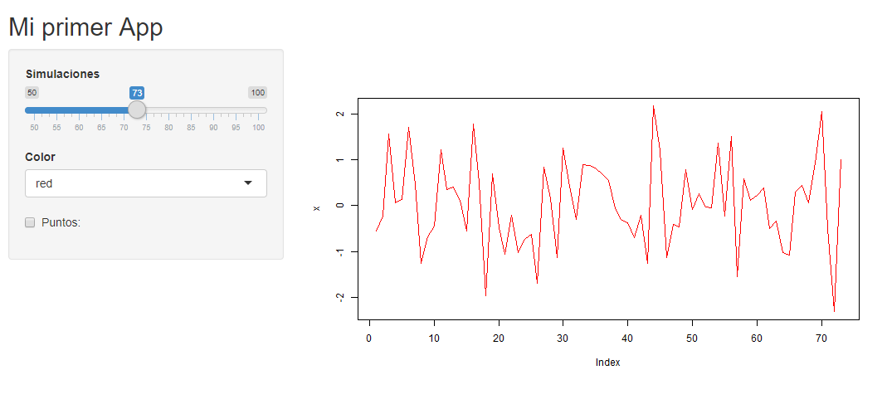
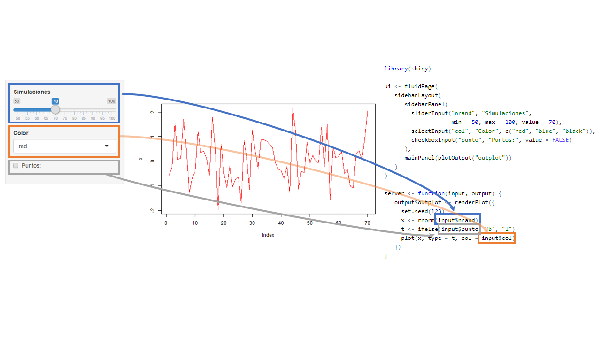
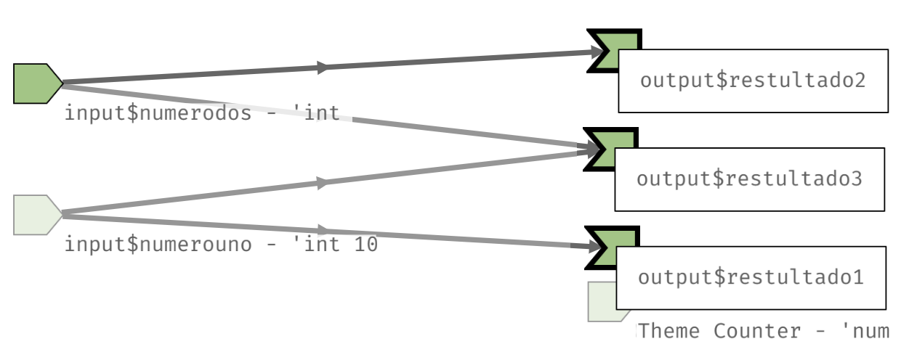

```{r setup, include=FALSE}
source("R/setup-xaringan.R")
```


```{r, child="readme.md"}
```


---

class: center, middle, inverse

# Antes de Partir

---

# Antes de Partir

La prestación podrá acceder desde https://jkunst.com/shiny-visualizacion-de-datos-con-R/clase-01.html y el código fuente, apps, ejemplos en https://github.com/jbkunst/shiny-visualizacion-de-datos-con-R

<br>

Asumimos que tenemos conocimiento de como funciona R, paquetes, funciones, etc.

No es necesario en `shiny` pero usaremos los paquetes `dplyr` y `ggplot2` principalmente
para hacer manipulación y visualización de los datos.

Necesitaremos algunos paquetes: 

```{r, eval=FALSE}
install.packages(
  c("tidyverse", "shiny", "shinythemes", "shinyWidgets", "bslib",
    "shinydashboard", "DT", "leaflet", "plotly", "highcharter")
  )
```

---

# Ayuda

No olvidar que una buena forma de aprender es con la documentación oficial:

- https://mastering-shiny.org/
- https://shiny.posit.co/r/getstarted/shiny-basics/lesson1/


---

# Por que shiny?

<br/>

<br/>

.center[
```{r, out.width = "800px", echo=FALSE}
knitr::include_graphics("imgs/data-science-communicate.png")
```
]


---

class: center, middle, inverse

# ¿Qué es una __app__(licación) web?

---

# Aplicación Web

(Wikipedia:) Herramientas que los usuarios pueden utilizar accediendo 
a un servidor web a través de internet o de una intranet mediante un navegador.

Puede ser de lo más simple...

.center[
```{r, echo=FALSE, out.width = "900px", out.}

```
]
---

# Aplicación Web

Hasta algo más complejo con más `input`s y `output`s

<!--  -->

.center[
```{r, out.width = "800px", echo=FALSE}
knitr::include_graphics("imgs/otraapp2.png")
```
]

---

# Ejemplos para motivarse!

<br/>

Algunos simples.

* https://jjallaire.shinyapps.io/shiny-kmeans/
* https://jbkunst.shinyapps.io/bias-variance/
(https://github.com/jbkunst/shiny-apps-educational)
<br/>

Otros con más detalle en la parte visual.

* https://jbkunst.shinyapps.io/trd-sttstcs/ (https://github.com/jbkunst/trd-sttstcs)
* https://jorgehcas1998.shinyapps.io/Dataton-app/ (https://github.com/socapal/dataton-tudinero)
* https://nz-stefan.shinyapps.io/commute-explorer-2
* https://odes-chile.org/app/unidades/

---

# La estructura de una ShinyApp

<br>

```{r, eval=FALSE}
library(shiny)

ui <- fluidPage()

server <- function(input, output) {}

runApp(list(ui = ui, server = server)) 
```

<br>

En `shiny`, una aplicación constará de **2** partes:

- La interfaz de usuario, `ui` (user interface), donde definiremos el look de nuestra aplicación, y lugar de  `inputs` y `outputs`.
- El `server`, en donde especificaremos como interactuan los `outputs` en función de los `inputs`.

---

# La estructura de una ShinyApp

<br>


```{r, eval=FALSE}
library(shiny)

ui <- fluidPage()                            #<<

server <- function(input, output) {}

runApp(list(ui = ui, server = server)) 
```


<br>

- Se define una interfaz de usuario (user interface). En adelante `ui`.
- En este caso es una página fluida vacía `fluidPage()`.


- En el futuro acá definiremos diseño/estructura de nuestra aplicación (_layout_).
Que se refiere la disposición de nuestros `inputs` y `outputs`.


---

# La estructura de una ShinyApp

<br>

```{r, eval=FALSE}
library(shiny)

ui <- fluidPage()                            

server <- function(input, output) {}         #<<

runApp(list(ui = ui, server = server)) 
```

<br>

- Se define el `server` en donde estará toda la lógica de nuestra aplicación.
- Principalmente serán instrucciones que dependeran de `inputs` y
reflejaremos `outputs`: como tablas, gráficos.


---

# La estructura de una ShinyApp

<br>

```{r, eval=FALSE}
library(shiny)

ui <- fluidPage()                            

server <- function(input, output) {}         

runApp(list(ui = ui, server = server))       #<<
```

<br>

- `runApp` es la funcion que crea y deja corriendo la app con los 
parámetros otorgados.
- **No siempre** tendremos que escribirla pues veremos que RStudio
al crear una shinyApp nos pondrá un botón para _servir_ la aplicación.


---

# La estructura de una ShinyApp

<br>

```{r, eval=FALSE}
library(shiny)

ui <- fluidPage()                            

server <- function(input, output) {}         

runApp(list(ui = ui, server = server))       
```

De formar general la aplicación será:

```{r, eval=FALSE}
library(shiny)
# acá se cargarán paquetes y posiblemente también datos
# necesarios para ui (como definir opciones de inputs)

ui <- fluidPage(
  # código que da forma a nuestrá aplicación: títulos, secciones, textos, inputs
)                            

server <- function(input, output) {
  # toooda la lógica de como interactuan los outputs en función de los inputs
}         
```

---

# Repaso R: Que hace el siguiente código?

<br>

```{r quehace, eval=FALSE}
set.seed(123)

x <- rnorm(10)
x

t <- ifelse(TRUE, "b", "l")
t

c <- "darkred"

plot(x, type = t, col = c)    
```

---

`r flipbookr::chunk_reveal("quehace", title = "# Repaso R: Que hace el siguiente código?", chunk_options = "fig.height = 5")`

---

`r flipbookr::chunk_reveal("quehace2", title = "# Repaso R: Que hace el siguiente código?", chunk_options = "fig.height = 5")`

```{r quehace2, eval=FALSE}
set.seed(123)

x <- rnorm(30)
x

t <- ifelse(FALSE, "b", "l")
t

c <- "green"

plot(x, type = t, col = c)    
```

---

# Ejercicio: Nuestra primer App andando

Hacer funcionar el siguiente `código` en R Rstudio: (hint: sí, copy + paste + run) 

.code70[
```{r, eval=FALSE}
library(shiny)

ui <- fluidPage(
   sidebarLayout(
      sidebarPanel(
        sliderInput("nrand", "Simulaciones", min = 50, max = 100, value = 70),
        selectInput("col", "Color", c("red", "blue", "black")),
        checkboxInput("punto", "Puntos:", value = FALSE)
      ),
      mainPanel(plotOutput("outplot"))
   )
)

server <- function(input, output) {
   output$outplot <- renderPlot({
     set.seed(123)
     x <- rnorm(input$nrand)
     t <- ifelse(input$punto, "b", "l")
     plot(x, type = t, col = input$col)
   })
}

shinyApp(ui, server)
```
]

---

class: center, middle, inverse

# Funcionamiento de una app de Shiny

---

# App


---

# Contenedor 


---

# Otros contenedores 


---

# Inputs 


---

# Outputs


---

# Interacción 



---

# Resultado


---

# La estructura de una ShinyApp 2


.code60[
```{r, eval=FALSE}
ui <- fluidPage(
   sidebarLayout(
      sidebarPanel(
        sliderInput("nrand", "Simulaciones", min = 50, max = 100, value = 70),
        selectInput("col", "Color", c("red", "blue", "black")),
        checkboxInput("punto", "Puntos:", value = FALSE)
      ),
      mainPanel(plotOutput("outplot"))
   )
)

server <- function(input, output) {
   output$outplot <- renderPlot({
     set.seed(123)
     x <- rnorm(input$nrand)
     t <- ifelse(input$punto, "b", "l")
     plot(x, type = t, col = input$col)
   })
}
```
]

---

# La estructura de una ShinyApp 2

.code60[
```{r, eval=FALSE}
ui <- fluidPage(                                                  #<<                                        
   sidebarLayout(                                                 #<<
      sidebarPanel(                                               #<<
        sliderInput("nrand", "Simulaciones", min = 50, max = 100, value = 70),
        selectInput("col", "Color", c("red", "blue", "black")),
        checkboxInput("punto", "Puntos:", value = FALSE)
      ),
      mainPanel(plotOutput("outplot"))                            #<<
   )
)

server <- function(input, output) {
   output$outplot <- renderPlot({
     set.seed(123)
     x <- rnorm(input$nrand)
     t <- ifelse(input$punto, "b", "l")
     plot(x, type = t, col = input$col)
   })
}
``` 
]

- `fluidPage`, `sidebarLayout`, `sidebarPanel`, `mainPanel` definen el diseño/_layout_ de nuestra
app.
-  Existen muchas más formas de organizar una app: Por ejemplo uso de _tabs_ de _menus_, o páginas
con navegación. Más detalles http://shiny.rstudio.com/articles/layout-guide.html.


---

# La estructura de una ShinyApp 2

.code60[
```{r, eval=FALSE}
ui <- fluidPage(                                                                                          
   sidebarLayout(                                                 
      sidebarPanel(                                               
        sliderInput("nrand", "Simulaciones", min = 50, max = 100, value = 70),             #<<
        selectInput("col", "Color", c("red", "blue", "black")),   #<<
        checkboxInput("punto", "Puntos:", value = FALSE)          #<<
      ),
      mainPanel(plotOutput("outplot"))                            
   )
)

server <- function(input, output) {
   output$outplot <- renderPlot({
     set.seed(123)
     x <- rnorm(input$nrand)
     t <- ifelse(input$punto, "b", "l")
     plot(x, type = t, col = input$col)
   })
}
``` 
]

- `sliderInput`, `selectInput`, `checkboxInput` son los inputs de nuestra app,
con esto el usuario puede interactuar con nuestra aplicación (https://shiny.rstudio.com/gallery/widget-gallery.html).
- Estas funciones generan el input deseado en la app y shiny perminte que los
valores de estos inputs sean usados como valores usuales en R en la parte del server
(numericos, strings, booleanos, fechas).

---

# La estructura de una ShinyApp 2

.code60[
```{r, eval=FALSE}
ui <- fluidPage(                                                                                          
   sidebarLayout(                                                 
      sidebarPanel(                                               
        sliderInput("nrand", "Simulaciones", min = 50, max = 100, value = 70),             
        selectInput("col", "Color", c("red", "blue", "black")),   
        checkboxInput("punto", "Puntos:", value = FALSE)          
      ),
      mainPanel(plotOutput("outplot"))                            #<<                       
   )
)

server <- function(input, output) {
   output$outplot <- renderPlot({
     set.seed(123)
     x <- rnorm(input$nrand)
     t <- ifelse(input$punto, "b", "l")
     plot(x, type = t, col = input$col)
   })
}
``` 
]

- `plotOutput` define el lugar donde la salida estará.
- Como mencionamos, nuestras app ueden tener muchos outputs: tablas, texto, imágenes.


---

# La estructura de una ShinyApp 2

.code60[
```{r, eval=FALSE}
ui <- fluidPage(                                                                                          
   sidebarLayout(                                                 
      sidebarPanel(                                               
        sliderInput("nrand", "Simulaciones", min = 50, max = 100, value = 70),             
        selectInput("col", "Color", c("red", "blue", "black")),   
        checkboxInput("punto", "Puntos:", value = FALSE)          
      ),
      mainPanel(plotOutput("outplot"))                                                   
   )
)

server <- function(input, output) {
   output$outplot <- renderPlot({                               #<<
     set.seed(123)
     x <- rnorm(input$nrand)
     t <- ifelse(input$punto, "b", "l")
     plot(x, type = t, col = input$col)
   })
}
``` 
]

- `renderPlot` define un tipo de salida gráfica.
- Existen otros tipos de salidas, como tablas `tableOutput` o tablas más interactivas como 
`DT::DTOutput`.


---

# La estructura de una ShinyApp 2

.code60[
```{r, eval=FALSE}
ui <- fluidPage(                                                                                          
   sidebarLayout(                                                 
      sidebarPanel(                                               
        sliderInput("nrand", "Simulaciones", min = 50, max = 100, value = 70),             
        selectInput("col", "Color", c("red", "blue", "black")),   
        checkboxInput("punto", "Puntos:", value = FALSE)          
      ),
      mainPanel(plotOutput("outplot"))                                                   
   )
)

server <- function(input, output) {
   output$outplot <- renderPlot({                               
     set.seed(123)                                              #<<
     x <- rnorm(input$nrand)                                    #<<
     t <- ifelse(input$punto, "b", "l")                         #<<
     plot(x, type = t, col = input$col)                         #<<
   })
}
``` 
]

- Este espacio determina la lógica de nuestra salida.
- Acá haremos uso de los inputs para entregar lo que deseamos.

---

# La estructura de una ShinyApp 2

.code60[
<pre class="r hljs remark-code">
ui <- fluidPage(                                                                                          
   sidebarLayout(                                                 
      sidebarPanel(                                               
        sliderInput("nrand", "Simulaciones", min = 50, max = 100, value = 70),             
        selectInput("col", "Color", c("red", "blue", "black")),   
        checkboxInput("punto", "Puntos:", value = FALSE)          
      ),
      mainPanel(<b>plotOutput</b>("outplot"))
   )
)

server <- function(input, output) {
   output$outplot <- <b>renderPlot</b>({                               
     set.seed(123)                                              
     x <- rnorm(input$nrand)                                    
     t <- ifelse(input$punto, "b", "l")                         
     plot(x, type = t, col = input$col)                         
   })
}
</pre>
]

- Las funciones `*Output()` y `render*()`  trabajan juntas para agregar salidas de R a la
interfaz de usuario
- En este caso `renderPlot` esta asociado con `plotOutput` (¿cómo?)
- Hay muchas parejas como `renderText`/`textOutput` o `renderTable`/`tableOutput` entre
otras (revisar la sección de outputs en el cheat sheet)
 
 
---

# La estructura de una ShinyApp 2

.code60[
<pre class="r hljs remark-code">
ui <- fluidPage(                                                                                          
   sidebarLayout(                                                 
      sidebarPanel(                                               
        sliderInput("nrand", "Simulaciones", min = 50, max = 100, value = 70),             
        selectInput("col", "Color", c("red", "blue", "black")),   
        checkboxInput("punto", "Puntos:", value = FALSE)          
      ),
      mainPanel(plotOutput(<b>"outplot"</b>))
   )
)

server <- function(input, output) {
   output$<b>outplot</b> <- renderPlot({                               
     set.seed(123)                                              
     x <- rnorm(input$nrand)                                    
     t <- ifelse(input$punto, "b", "l")                         
     plot(x, type = t, col = input$col)                         
   })
}
</pre>
]

- Cada `*Output()` y `render*()` se asocian con un **id** definido por nosotros
- Este **id** debe ser único en la applicación
- En el ejemplo `renderPlot` esta asociado con `plotOutput` vía el id `outplot`

---

# La estructura de una ShinyApp 2

.code60[
<pre class="r hljs remark-code">
ui <- fluidPage(                                                                                          
   sidebarLayout(                                                 
      sidebarPanel(                                               
        sliderInput(<b>"nrand"</b>, "Simulaciones", min = 50, max = 100, value = 70),             
        selectInput("col", "Color", c("red", "blue", "black")),   
        checkboxInput("punto", "Puntos:", value = FALSE)          
      ),
      mainPanel(plotOutput("outplot"))
   )
)

server <- function(input, output) {
   output$outplot <- renderPlot({                               
     set.seed(123)                                              
     x <- rnorm(input$<b>nrand</b>)                                    
     t <- ifelse(input$punto, "b", "l")                         
     plot(x, type = t, col = input$col)                         
   })
}
</pre>
]

- Cada functión `*Input` requiere un **id** para ser identificado en el server
- Cada `*Input` requiere argumentos especificos a cada tipo de input, valor por defecto,
etiquetas, opciones, rangos, etc
- Acá, el valor númerico ingresado/modifcado por el usuario se puede 
acceder en el server bajo `input$nrand`


---

# La estructura de una ShinyApp 2

.code60[
<pre class="r hljs remark-code">
ui <- fluidPage(                                                                                          
   sidebarLayout(                                                 
      sidebarPanel(                                               
        sliderInput(<b>"nrand"</b>, "Simulaciones", min = 50, max = 100, value = 70),             
        selectInput(<b>"col"</b>, "Color", c("red", "blue", "black")),   
        checkboxInput(<b>"punto"</b>, "Puntos:", value = FALSE)          
      ),
      mainPanel(plotOutput("outplot"))
   )
)

server <- function(input, output) {
   output$outplot <- renderPlot({                               
     set.seed(123)                                              
     x <- rnorm(input$<b>nrand</b>)                                    
     t <- ifelse(input$<b>punto</b>, "b", "l")                         
     plot(x, type = t, col = input$<b>col</b>)                         
   })
}
</pre>
]

- `sliderInput` se usa para seleccionar un valor numérico entre un rango 
- `selectInput` otorga la posibildad que el usuario escoge entre un conjunto de valores
- `checkboxInput` en el server es un valor lógico `TRUE`/`FALSE`
- ¿Necesitas más? https://gallery.shinyapps.io/065-update-input-demo/ y http://shinyapps.dreamrs.fr/shinyWidgets/ 

---

# Paquete {bslib}

Contenerdoes como `fluidPage`, `sidebarLayout`, `mainPanel` son basadas en boostrap 3. Para tener un diseño más actualizado se usa el paquete `{bslib}`. Notar que cambia solamente el ui/layout.

.code70[
```{r, eval=FALSE}
library(shiny)
library(bslib)

ui <- bslib::page_sidebar(                                     #<<    
  title = "Mi primer app bslib",    
  sidebar = bslib::sidebar(                                   #<<    
    sliderInput("nrand", "Simulaciones", min = 50, max = 100, value = 70),
    selectInput("col", "Color", c("red", "blue", "black")),
    checkboxInput("punto", "Puntos:", value = FALSE)
  ),
  plotOutput("outplot")
  )

server <- function(input, output) {
  output$outplot <- renderPlot({
    set.seed(123)
    x <- rnorm(input$nrand)
    t <- ifelse(input$punto, "b", "l")
    plot(x, type = t, col = input$col)
  })
}

shinyApp(ui, server)
```
]

---

# Paquete {bslib}

Contenerdoes como `fluidPage`, `sidebarLayout`, `mainPanel` son basadas en boostrap 3. Para tener un diseño más actualizado se usa el paquete `{bslib}`. Notar que cambia solamente el ui/layout.

.code70[
```{r, eval=FALSE}
library(shiny)
library(bslib)

ui <- page_sidebar(                                     #<<    
  title = "Mi primer app bslib",    
  sidebar = sidebar(                                   #<<    
    sliderInput("nrand", "Simulaciones", min = 50, max = 100, value = 70),
    selectInput("col", "Color", c("red", "blue", "black")),
    checkboxInput("punto", "Puntos:", value = FALSE)
  ),
  plotOutput("outplot")
  )

server <- function(input, output) {
  output$outplot <- renderPlot({
    set.seed(123)
    x <- rnorm(input$nrand)
    t <- ifelse(input$punto, "b", "l")
    plot(x, type = t, col = input$col)
  })
}

shinyApp(ui, server)
```
]


---

# Ejercicio: Inputs y outputs vengan a mi!


Haga click en:

- _File_, luego _New File_ y _Shiny Web App_, seleccione el nombre
- Ejecutela con _Run App_ e intearctúe
- Luego modifique y cree una app que contenga:
  - 2 inputs, un `sliderInput` y un `textInput` 
  - 3 outputs de tipo texto `textOutput` donde el primero contenga 
el valor del primer input, el segundo el valor del segundo input, y el tercero la suma de los
dos.


Hints importantes:

- No tema a escribir, ni preguntar!
- Está totalmente permitido equivocarse, de hecho se pondrán puntos extras.


---

# Solucion 

.code60[
<pre class="r hljs remark-code">
ui <- fluidPage(
    titlePanel("Applicación ejercicio 1"),
    sidebarLayout(
        sidebarPanel(
            sliderInput("numerouno", "#1", min = 10, max = 500, value = 100),
            textInput("numerodos", "#2", value = 3)
        ),
        mainPanel(
           textOutput("resultado1"),
           textOutput("resultado2"),
           textOutput("resultado3")
        )
    )
)

server <- function(input, output) {

  output$resultado1 <- renderText({
    x <- input$numerouno
    x
  })
  
  output$resultado2 <- renderText({
    input$numerodos
  })
  
  output$resultado3 <- renderText({
    input$numerouno + input$numerodos
  })
  
}
</pre>
]

---

# Solucion (ver. 2)

.code60[
<pre class="r hljs remark-code">
ui <- fluidPage(
    titlePanel("Applicación ejercicio 1"),
    sidebarLayout(
        sidebarPanel(
            sliderInput("numerouno", "#1", min = 10, max = 500, value = 100),
            numericInput("numerodos", "#2", value = 3)
        ),
        mainPanel(
           textOutput("resultado1"),
           textOutput("resultado2"),
           textOutput("resultado3")
        )
    )
)

server <- function(input, output) {

  output$resultado1 <- renderText({
    x <- input$numerouno
    x
  })
  
  output$resultado2 <- renderText({
    input$numerodos
  })
  
  output$resultado3 <- renderText({
    input$numerouno + as.numeric(input$numerodos)
  })
  
}
</pre>
]


---

# Reactividad: Como funciona shiny

Consideremos la aplicación del ejemplo anterior. 

Al cambiar un input -como lo es `input$numerouno` o `input$numerodos`- shiny
reconoce que expresiones (renders, como `renderText` en este caso) dependen
dichos elementos y vuelve a calcularlos a penas suceda el cambio.

.center[
```{r, out.width = "800px", echo=FALSE}

```
]

En este sentido, shiny funciona similar a excel.
