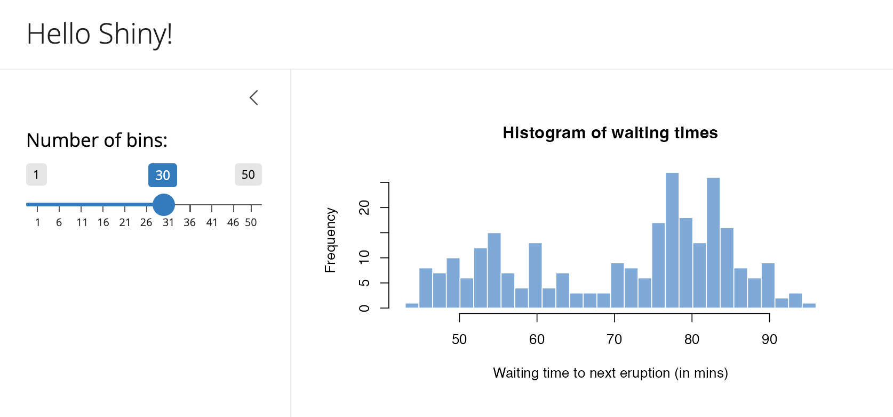

```{r setup, include=FALSE}
source("R/setup-xaringan.R")
knitr::opts_chunk$set(warning = FALSE, message = FALSE, fig.path = "imgs/clase2/")
```


```{r, child="readme.md"}
```

---

class: center, middle, inverse

# Layouts

---

# Layouts

<br/>
Laytous se refiere a la disposición de elementos -como inputs, textos,
outputs- en nuestra app. Dependiendo de las necesidades puede ser convenientes algunos
tipos de layuts sobre otros.

--

<br/>
Como mencionamos anteriormente {shiny} utiliza boostrap 3, y seguirá usando 
esta versión  para evitar problemas de compatibilidad con aplicaciones existentes y mantener la estabilidad en diseños desarrollados bajo esa versión.

--

<br/>
Para usar versiones recientes de boostrap se debe utilizar el paquete {bslib} que
viene con otro contenedores (funciones) y nuevas funcionalidades, como _valueBox_es.


---

# {shiny} Tipos de Layouts

<br/>

.center[
```{r, out.width = "800px", echo=FALSE}
knitr::include_graphics("imgs/shiny-layouts.png")
```
]


---

# {shiny} sidebarLayout

<br/>


---

# {shiny} sidebarLayout - Estructura

Es una distribución simple donde lo primero en aparecer es los controles o
inputs.

Luego viene el panel principal el cual posee mayor espacio.


.center[
```{r, out.width = "800px", echo=FALSE}
knitr::include_graphics("imgs/sidebar2.png")
```
]

---

# {shiny} sidebarLayout - Ejemplo código

.code70[
```r
library(shiny)

ui <- fluidPage(
    titlePanel("Hello Shiny!"),

    sidebarLayout(
        sidebarPanel(
            sliderInput("bins", "Number of bins:", min = 1, max = 50, value = 30)
        ),
        mainPanel(
           plotOutput("distPlot")
        )
    )
)

server <- function(input, output) {

    output$distPlot <- renderPlot({
        x    <- faithful[, 2]
        bins <- seq(min(x), max(x), length.out = input$bins + 1)

        hist(x, breaks = bins, col = 'skyblue', border = 'white',
             xlab = 'Waiting time to next eruption (in mins)',
             main = 'Histogram of waiting times')
    })
}

shinyApp(ui = ui, server = server)
```
]

---

# {shiny} Tipos de Paneles de Navegación

Es posible que nuestra aplicación vaya creciendo, en dicho caso, Los paneles 
nos permiten organizar distintas secciones de la aplicación.

.center[
```{r, out.width = "800px", echo=FALSE}
knitr::include_graphics("imgs/navlayouts.png")
```
]

---

# {shiny} tabsetPanel

Los tabs (`tabsetPanel`) son útiles para separar secciones _similares_ en nuestra app. A diferencia de por ejemplo `navbarPage`.

.code70[
```{r, eval=FALSE}
library(shiny)

ui <- fluidPage(
  titlePanel("Hello Shiny!"),
  sidebarLayout(
    sidebarPanel(
      sliderInput("obs", "Number of observations:", min = 0, max = 1000, value = 500)
    ),
    mainPanel(
      tabsetPanel(
        tabPanel("Plot", plotOutput("plot")),
        tabPanel("Summary", verbatimTextOutput("summary")),
        tabPanel("Table", tableOutput("tabla"))
      )
    )
  )
)

server <- function(input, output) {
  output$plot <- renderPlot({ hist(rnorm(input$obs)) })
  output$summary <- renderText({ input$obs })
  output$tabla <- renderTable({ data.frame(input$obs) })
}

shinyApp(ui, server)
```
]

---

# {shiny} tabsetPanel

Los tabs (`tabsetPanel`) son útiles para separar secciones _similares_ en nuestra app. A diferencia de por ejemplo `navbarPage`.


---

# Ejercicio: Modificar la estructura de la aplicación

<br/>

Nivel _fácil, para calentar las manos_: Para el ejemplo de `sidebarLayout`: Modifique la aplicación para que posea un layout de tipo `flowLayout`.

<br/>

Nivel _entretenido_: Para el ejemplo de `tabsetPanel` agregue:
  - Un tab más con un gráfico de líneas.
  - Un tab que utilice la función `summary` para mostra resúmen de los datos.
  - Modifique la applicación para utilizar la función `navbarPage`.

---

# Solución 1

```r
library(shiny)

ui <- fluidPage(
  titlePanel("Hello Shiny!"),
  flowLayout(
    sliderInput("obs", 
                "Number of observations:",
                min = 0, 
                max = 1000, 
                value = 500),
    plotOutput("distPlot")
    )
  )

server <- function(input, output) {
  output$distPlot <- renderPlot({
    hist(rnorm(input$obs)) 
    })
}

shinyApp(ui, server)
```

---

# Solución 2

.pull-left[
```r
library(shiny)
library(ggplot2)

ui <- navbarPage(
  title = "Hello Shiny!",
  tabPanel("Plot",
           sliderInput("obs", 
           "Number of observations:", 
           min = 0, max = 1000, value = 500),
           plotOutput("plot")
           ),
  tabPanel("Línea", plotOutput("linea")),
  tabPanel("Summary", verbatimTextOutput("summary")),
  tabPanel("Table", tableOutput("tabla"))
)
```
]

.pull-right[
```r
server <- function(input, output) {
  output$plot <- renderPlot({
    hist(rnorm(input$obs))
    })
  output$summary <- renderPrint({
    summary(rnorm(input$obs))
    })
  output$tabla <- renderTable({ 
    data.frame(rnorm(input$obs)) 
    })
  output$linea <- renderPlot({
    x <- rnorm(input$obs)
    qplot(x = 1:input$obs, x, geom = "line")
  })
  
  
}

shinyApp(ui, server)
```
]

---

# {bslib} page_sidebar



---

# {bslib} page_sidebar

.pull-left[
```r
library(shiny)
library(bslib)

ui <- page_sidebar(

  title = "Hello Shiny!",

  sidebar = sidebar(
    sliderInput(
      "bins", label = "Number of bins:",
      min = 1, value = 30, max = 50
    )
  ),

  plotOutput("distPlot")
)
```
<small>https://shiny.posit.co/r/articles/build/layout-guide/</small>
]

.pull-right[

]


---

# {bslib} page_navbar


.code70[
```r
ui <- page_navbar(
  title = "My App",
  bg = "#2D89C8",
  inverse = TRUE,
  nav_panel(title = "One", p("First page content.")),
  nav_panel(title = "Two", p("Second page content.")),
  nav_panel(title = "Three", p("Third page content.")),
  nav_spacer(),
  nav_menu(
    title = "Links",
    align = "right",
    nav_item(tags$a("Posit", href = "https://posit.co")),
    nav_item(tags$a("Shiny", href = "https://shiny.posit.co"))
  )
)
```
]


---

class: center, middle, inverse

# HTMLWidgets

---

# HTMLWidgets

HTMLWidgets son un tipo de paquetes que nos permiten realizar visualizaciones en HTML
las cuales se pueden usar en (1) consola, (integrar) integrar con shiny y también (3) rmarkdown.

Existen una gran cantida de paquetes https://gallery.htmlwidgets.org/, y nos sirven 
para complementar nuestra aplicación. 

Cada paquete HTMLWidget tiene su propio set de funciones, el código utilizado  para hacer un gráfico en plotly no es el mismo (pero generalmente muy similar)
al utilizado en highcharter, echarts4r:

- https://plotly.com/r/
- https://jkunst.com/highcharter/
- https://echarts4r.john-coene.com/
- https://rstudio.github.io/leaflet/
- https://rstudio.github.io/DT/

Ejemplo de uso de script https://github.com/jbkunst/shiny-visualizacion-de-datos-con-R/blob/master/R/script-htmlwidgets.R 

---

`r flipbookr::chunk_reveal("ggplot2", title = "# Antes, un poco de {ggplot2}")`

```{r ggplot2, include = FALSE}
library(ggplot2)

data(iris)

ggplot(iris, aes(Sepal.Length, Sepal.Width)) +
  geom_point(aes(color = Species), size = 2.5) +
  scale_color_viridis_d(end = .9) +
  geom_smooth(method = "lm") +
  facet_wrap(vars(Species)) +
  theme_minimal()
```

---

# {plotly}

.pull-left[
```{r plotly, eval = FALSE}
library(ggplot2)
library(plotly)

data(iris)

p <- ggplot(iris, aes(Sepal.Length, Sepal.Width)) +
  geom_point(aes(color = Species), size = 2.5) +
  scale_color_viridis_d(end = .9) +
  geom_smooth(method = "lm") +
  facet_wrap(vars(Species)) +
  theme_minimal()

ggplotly(p)
```
]

.pull-right[
```{r ref.label='plotly', eval=TRUE, echo=FALSE}
```
]


---

# {highcharter}

.pull-left[
```{r highcharter, eval=FALSE}
library(highcharter)
library(forecast)

data("AirPassengers")

modelo <- forecast(auto.arima(AirPassengers))

hchart(modelo) |>
  hc_add_theme(hc_theme_hcrt()) |>
  hc_navigator(enabled = TRUE) |>
  hc_rangeSelector(enabled = TRUE) |>
  hc_title(text = "Proyección")
```
]

.pull-right[
```{r ref.label='highcharter', eval=TRUE, echo=FALSE}
```
]


---

# Unos datos

.pull-left[
```{r sismos, eval=FALSE}
library(rvest)   # descargar datos de paginas web

url <- "https://www.sismologia.cl/sismicidad/catalogo/2024/11/20241103.html"

datos <- read_html(url) |>
  html_table() |>
  dplyr::nth(2) |>
  janitor::clean_names() |>
  tidyr::separate(
    latitud_longitud,
    into = c("latitud", "longitud"),
    sep = " ", convert = TRUE
  )

datos
```
]

.pull-right[
```{r ref.label='sismos', eval=TRUE, echo=FALSE}
```
]


---

# {leaflet}

.pull-left[
```{r dt, eval=FALSE}
library(DT)

datatable(datos)
```
]

.pull-right[
```{r ref.label='dt', eval=TRUE, echo=FALSE}
```
]


---

# {leaflet}

.pull-left[
```{r leaflet, eval=FALSE}
library(leaflet)

leaflet(datos) |>
  addTiles() |>
  addMarkers(
    lng = ~longitud,
    lat = ~latitud,
    popup = ~as.character(magnitud_2),
    label = ~as.character(`fecha_local_lugar`)
  ) |>
  addProviderTiles("Esri.WorldImagery")
```
]

.pull-right[
```{r ref.label='leaflet', eval=TRUE, echo=FALSE}
```
]


---

# Pero como usar HTMLWidgets en nuestra App?

<br>

Cada uno de los HTMLWidgets presentados, en su documentación detallan 
como usarlos en una aplicación shiny.

De forma general en cada paquete existirá una función tipo:

- `*Output` para colocarla en el `ui`.
- `render*` para definirla en el `server`

A modo de ejemplo, el paquete `leaflet` tiene `leafletOutput()` y `renderLeaflet()`.

Los anterior está documentado en https://rstudio.github.io/leaflet/shiny.html.


---

# Ejercicio: Agregar HTMLWidgets a la app

<br/>

A la aplicación obtenida de modificar la de `tabsetPanel` (Nivel _entretenido_),
modificar gráficos y tablas para incluir algunos HTMLWidgets.

---

# Solución


.pull-left[
```r
library(shiny)
library(ggplot2)
library(plotly)
library(DT)

ui <- navbarPage(
  title = "Hello Shiny!",
  tabPanel("Plot",
           sliderInput("obs", 
           "Number of observations:",
           min = 0, max = 1000, value = 500),
           plotOutput("plot")
           ),
  tabPanel("Línea", plotlyOutput("linea")),
  tabPanel("Summary", verbatimTextOutput("summary")),
  tabPanel("Table", DTOutput("tabla"))
)
```
]

.pull-right[
```r
server <- function(input, output) {
  output$plot <- renderPlot({
    hist(rnorm(input$obs))
    })
  output$summary <- renderPrint({
    summary(rnorm(input$obs))
    })
  output$tabla <- renderDT({ 
    d <- data.frame(rnorm(input$obs))
    datatable(d)
    })
  output$linea <- renderPlotly({
    y <- rnorm(input$obs)
    p <- qplot(x = 1:input$obs, y = y, geom = "line")
    ggplotly(p)
  })
  
}

shinyApp(ui, server)
```
]

---

# Solución v2


.pull-left[
```r
library(shiny)
library(ggplot2)
library(plotly)
library(DT)

ui <- navbarPage(
  title = "Hello Shiny!",
  tabPanel("Plot",
           sliderInput("obs",
          "Number of observations:", 
                min = 0, max = 1000, value = 500),
    plotlyOutput("plot")
  ),
  tabPanel('Linea', plotOutput('linea')),
  tabPanel("Summary", textOutput("summary")),
  tabPanel("Table", dataTableOutput("tabla")),
  tabPanel('Resumen', verbatimTextOutput('resumen'))
)
```
]

.pull-right[
```r
server <- function(input, output) {
  output$plot <- renderPlotly({ 
    n <- input$obs
    x <- rnorm(n)
    p <- qplot(x, geom = "histogram")
    ggplotly(p)
  })
  
  output$summary <- renderText({ input$obs })
  output$tabla <- renderDataTable({ 
    df <- data.frame(1:input$obs) 
    datatable(df)
    })
  output$resumen <- renderPrint({
    summary(rnorm(input$obs))
  } )
  output$linea <- renderPlot({   
    plot(rnorm(input$obs), type = 'l')
  })
}
shinyApp(ui, server)
```
]


