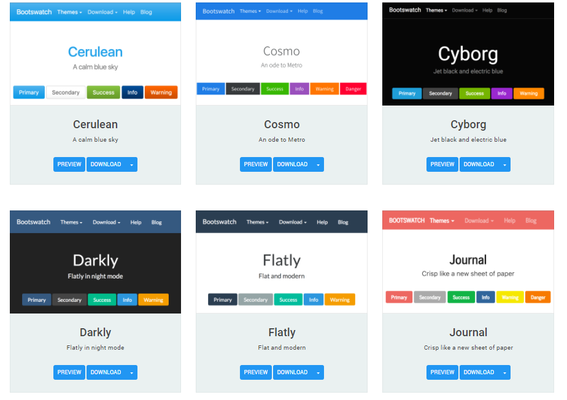
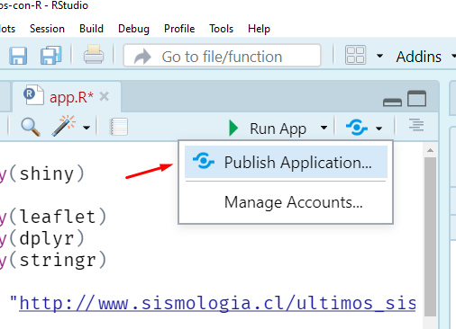

```{r setup, include=FALSE}
source("R/setup-xaringan.R")
```


```{r, child="readme.md"}
```

---

class: center, middle, inverse

# Repaso resumido

---

# Repaso resumido

- Una shiny app consta de dos partes:
  - `ui` (**u**ser **i**nterface) donde definiremos el lugar de los los `input`s que 
  el usuario podrá controlar, como también el lugar de donte estarán los `output`s que retornemos.
  - `server` (**server** XD), donde definiremos que retornaremos en cada output dependiendo de los inputs.

<hr>

- Los inputs de forma general son de la forma `tipoInput("nombreinput", parametros_del_input)`, por ejemplo
`sliderInput("valor", label = "Valor", min = 1, max = 10, value = 1)`.
- En el server accedo al valor del input como `input$nombreinput`. 


<hr>

- Un output se define en la interfaz (gráfico, tabla, mapa, texto) con la forma `tipoOutput("nombreoutput")`, por ejemplo si quiero una salida/output tipo gráfico se usa `plotOutput("grafico")`
- Para enviar un grafico en el server se usa: `output$nombreoutput <- renderTipo({ codigo })`, por ejemplo:

`output$grafico <- renderPlot({ plot(rnorm(input$valor), type = "l") })`

---

# Repaso resumido

Así nuestra app de repaso quedaría:

```r
library(shiny)

# Antes del ui y server podemos cargar paquetes
# o datos que nuestra app usará. No tiene por que ser todo
# tan simple

ui <- fluidPage(
  sliderInput("valor", label = "Valor", min = 1, max = 10, value = 1),
  plotOutput("grafico"),
  ...
  )

server <- function(input, output) {
  output$grafico <- renderPlot({ 
    plot(rnorm(input$valor), type = "l")
  })
  ...
}

shinyApp(ui, server)
```

---

# Ejercicio: Juntando inputs, laytous, htmlwidgets

Generar una aplicación que considere/tenga:

- El app debe ser generada con un `navbarPage` (con una única sección `tabPanel`)

- En la única sección considere un `sidebarPanel`.

- La aplicación debe poseer un selector de fecha.

- Dada una fecha, la aplicación muestre una tabla con la información
de sismos de la fecha asociada y un mapa. Ayúdese generando una función 
para descargar la información dada una fecha.

- Adicionalmente un _leaflet_ con la ubicación de los sismos.

- Incorpore texto con información de la fecha seleccionada.

---

# Solución

.pull-left[.code60[
```r
library(shiny)
library(leaflet)
library(rvest)
library(dplyr)
library(janitor)
library(tidyverse)
library(lubridate)

ui <- navbarPage(
  "VerSismos", 
  tabPanel(
    "Sismos",
    sidebarLayout(
      sidebarPanel(
        dateInput(
          "fecha",
          label = h3("Seleccione fecha por favor"),
          max = Sys.Date()
          )
      ),
      mainPanel(leafletOutput("mapa"))
      )
    )
  )

```
]]

.pull-right[.code60[
```r
server <- function(input, output){
  
  output$mapa <- renderLeaflet({
    
    fecha <- ymd(input$fecha)
    
    url <- format(fecha, "https://www.sismologia.cl/sismicidad/catalogo/%Y/%m/%Y%m%d.html")
    
    datos <- read_html(url) |>
      html_table() |>
      dplyr::nth(2) |>
      janitor::clean_names() |>
      tidyr::separate(latitud_longitud, into = c("latitud", "longitud"),
        sep = " ", convert = TRUE
      )
    
    leaflet(datos) |>
      addTiles() |>
      addMarkers(
        lng = ~longitud,
        lat = ~latitud,
        popup = ~as.character(magnitud_2),
        label = ~as.character(`fecha_local_lugar`)
      )
    
  })
  
}

shinyApp(ui, server)
```
]]

---

# Ejercicio: Transformando script R en una App

Muy común es que dado un código o proceso que hemos programado, lo necesitaremos
migrar a una shiny app o documento rmarkdown. Entonces:

- Inspeccionar, ejecutar y modificar el script de la siguiente slide.

- Generar una app que tenga como input una lista de países y
muestre el forecast de las exportaciones de dicho país.

- _Encapsule_ la lógica de la aplicación en una función.

- Luego utilizar algn HTMLWidget para complementar la aplicación.

Posible solución en https://github.com/jbkunst/shiny-visualizacion-de-datos-con-R/blob/main/apps/exportaciones/app.R

---

# Código

.code60[
```{r, eval=FALSE}
if(!require(forecast)) install.packages("forecast")
if(!require(xts))      install.packages("xts")
if(!require(ggplot2))  install.packages("ggplot2")
if(!require(dplyr))    install.packages("dplyr")
if(!require(remotes))  install.packages("remotes")
if(!require(tradestatistics))  remotes::install_github("ropensci/tradestatistics")

library(forecast) # forecast autoplot
library(xts) # xts
library(tradestatistics) # ots_create_tidy_data 
library(ggplot2) # autoplot
library(dplyr) # glimpse |> group_by summarise

pais <- "can"  # seteo pais, usa, can

data <- ots_create_tidy_data(years = 2002:2019, reporters = pais, table = "yrp")

glimpse(data)

data <- data |> 
  group_by(year, reporter_iso) |> 
  summarise(exportaciones = sum(trade_value_usd_exp))

valores <- data$exportaciones

fechas <- as.Date(paste0(data$year, "0101"), format = "%Y%m%d")

serie <- xts(valores, order.by = fechas) # creo la serie de tiempo para la fucion forecast

prediccion <- forecast(serie, h = 5) # realizo automágicamente una predicción

autoplot(prediccion)
```
]


---

# Solución

De tarea!

---

class: center, middle, inverse

# Temas & Estilos

---

# Temas & Estilos

- Al principio todas nuestras app son similares.
- Existen extensiones/paquetes que permiten cambiar el estilo/look de la aplicación.

.center[

]

---

# App para ejemplos

Utilizaremos la siguiente app para ver cada uno de los ejemplos:

```r
library(shiny)
library(ggplot2)

ui <- fluidPage(
  titlePanel("Old Faithful Geyser Data"),
  sidebarLayout(
    sidebarPanel(
      sliderInput("bins","Number of bins:", min = 1, max = 50, value = 30),
      textInput("titulo", "Ingrese titulo"),
      actionButton("boton", "No hago nada", class = "btn-primary")
    ),
    mainPanel(plotOutput("distPlot"))
  )
)

server <- function(input, output) {
  output$distPlot <- renderPlot({
    qplot(faithful[, 2], geom = "histogram", bins = input$bins + 1) + ggtitle(input$titulo)
  })
}

shinyApp(ui = ui, server = server)
```

---

# Paquete {bslib} + bootswatch

Los más fácil de implementar, sin tan alto impacto en código ni imagen. Opciones en http://bootswatch.com/.

Esto se implementa con `theme = bs_theme(bootswatch = "cerulean")`, como veremos en 
la siguiente slide.    

.center[

]

---

# Usando temas de bootswatch

Antes:

```r
library(shiny)

ui <- fluidPage(
   sidebarLayout(...
```

Ahora:

```r
library(shiny)
library(bslib)

ui <- fluidPage(
  theme = bs_theme(bootswatch = "paper"),
  titlePanel("Old Faithful Geyser Data"),
  sidebarLayout(...
```

Intentemos ahora con Darkyl, Flatly, Cosmos, Cerulean

**NOTAR** que este cambio es solo en la parte ui. La parte del server no cambia.

---

# Incorporando propios estilos

Con `bs_theme` un puede cambiar varios elementos estéticos de la aplicación. En un principio, a modo de ejemplo, utilizaremos color de fondo, fuente, y tipografías de google para los _header_ y la aplicación.


```r
library(shiny)
library(ggplot2)
library(bslib)

ui <- fluidPage(
  theme = bs_theme(
    bg = "#FFFDD0",  # background: color de fondo
    fg = "#202A44",  # foreground: color de letra
    heading_font = font_google("Mouse Memoirs"),
    base_font = font_google("Uchen")
    ),
  titlePanel("Old Faithful Geyser Data"),
  sidebarLayout(...
```

- https://unleash-shiny.rinterface.com/beautify-with-bootstraplib.html
- https://fonts.google.com/specimen/Mouse+Memoirs?query=Mouse+Memoirs
- https://www.colorhexa.com/FFFDD0

---

# Incorporando propios estilos + {thematic} 

Adicionalmene, con {thematic} los gráficos incorporarán las mismas reglas de estilo -colores- que la aplicación.

```r
library(shiny)
library(ggplot2)
library(bslib)
library(thematic)

thematic_shiny(font = "Press Start 2P")

ui <- fluidPage(
  theme = bs_theme(
    bg = "#f5f5f5",       
    fg = "#202A44",      
    primary = "#8B0000", # color primario, acentos.
    heading_font = font_google("Mouse Memoirs"),
    base_font = font_google("Press Start 2P")
  ),
  titlePanel("Old Faithful Geyser Data"),
  sidebarLayout(...
```

Más info en https://rstudio.github.io/thematic/.

---

# {shinydashboard} 

El paquete {shinydashboard} nos ayuda a generar una app con estilo de  __dashboards__ demás de incorporar otros elementos para incorporar
información.

.center[

]

---

# {shinydashboard} 

El paquete nos provee de funciones/contenedores para generar la estructura
que los dashboard poseen: `dashboardPage`, `dashboardHeader`, `dashboardSidebar`, 
`dashboardBody`.

```r
library(shinydashboard)

ui <- dashboardPage(
  dashboardHeader(),
  dashboardSidebar(
     sliderInput("valor", label = "Valor", min = 1, max = 10, value = 1)
  ),
  dashboardBody(
    fluidRow(box(width = 12, plotOutput("grafico")))
  )
)
```

Adicionalmente provee de otros elementos como `valueBox`, `box`, `infoBox`. 

Documentación en https://rstudio.github.io/shinydashboard/structure.html.


---

# Más y más templates y diseños

Existen muchos paquetes para cambiar estilos/css.

- shinydashboardPlus: https://rinterface.com/shiny/shinydashboardPlus/

- bs4Dash: https://rinterface.com/shiny/bs4Dash/classic/

- miniUI2Demo: https://dgranjon.shinyapps.io/miniUI2Demo

- tablerDash: https://rinterface.com/shiny/tablerDash/

Notar que estos paquetes cambian solos el diseño de la interfaz, como textos.

---

# Ejercicio: Aplicar temas

Tomar la siguiente aplicación:
- Modifcar el tema con un tema bootswatch.
- Aplicar un tema utilizando `bs_theme` + {thematic} + {showtext}.
- Modifcar el ui utilizando el ejemplo de `shinydashboard` (copy+paste).


```r
library(shiny)
ui <- fluidPage(
  titlePanel("Titulo de la aplicación"),
  sliderInput("valor", label = "Valor", min = 1, max = 10, value = 1),
  plotOutput("grafico")
  )
server <- function(input, output) {
  output$grafico <- renderPlot({ 
    plot(rnorm(input$valor), type = "l")
  })
}
shinyApp(ui, server)
```

---

# Solución 1

---

# Solución 2

---

# Solución 3

---

class: center, middle, inverse

# Publicar/Compartir tu app

---

# Publicar/Compartir tu app

Existen dos formas simples/sencillas para compartir una aplicación. Es decir
que sea visible en otros dispositivos pc/móviles. Luego existen otras 
que requieren de mayor conocimiento técnico.

### Vía IP local

Permite que tu pc sirva la aplicación y pueda ser visible en una red local 
(por ejemplo, la de tu casa), o también en una VPN.

### Servicio shinyapps.io

Permite que otro pc (una máquina virtual) sirva tu apliación y la exponga 
con una url pública. Ejemplo https://usuario.shinyapps.io/nombreapp.

### Otras

Como por ejemplo arrendar una máquina virtual linode/digitalocean/aws e 
instalar shinyserver.

---

# Vía IP local

- Solamente funciona para redes locales (casa/trabajo) o tambien VPN.
- Requiere que _nuestro_ pc esté encendido para que la app corra.

<br> 

Básicamente se obtiene la IP (_dirección de nuesto pc_) a través de una instrucción y luego se especifica correr la aplicación con dicha IP.

Se deberá cambiar:

```{r, eval=FALSE}
shinyApp(ui = ui, server = server)
```

Por:

```{r, eval=FALSE}
# esto es en windows
ip <- gsub(".*? ([[:digit:]])", "\\1", system("ipconfig", intern=T)[grep("IPv4", system("ipconfig", intern = T))])

shinyApp(ui = ui, server = server, options = list(host = ip))
```


---

# Servicio shinyapps.io

- Básicamente sube todo lo que está en la carpeta de la aplicación archivos R y **otros** 
a una máquina virtual y detecta los paquetes utilizados.
- La versión gratuita tienes horas de uso que se van recuperando cada mes. Está
máquina virtual es humilde en términos de recursos, puede ser lenta dependiendo
del uso.


Primero se debe una cuenta en https://www.shinyapps.io/ (puedes asociar tu correo gmail).
Luego crear una app.
- `rsconnect::deployApp("<ruta_a_la_aplicacion>")`, o:

.center[

]

---

# Ejercicio: Intentado usar todo

- Cree un **proyecto** en RStudio y seleccione crear una Shiny App.

- Descargue:
  - Puntos bip! http://datos.gob.cl/dataset/28198 
  - GTFS (?) del transantiago https://www.dtpm.cl/index.php/noticias/gtfs-vigente
  
- Importe los datos de puntos bips en R. Limpiarlos si es necesario.

- Cree una aplicación que tenga un selector de comunas, y que su 
aplicación retorne un mapa con las ubicaciones de los lugares de cargasbip
de la comuna seleccionada.

- Agregar un thema shinythemes/thematic.

- Evaluar agregar más outputs, o enriquecer el mapa.

- Subir la aplicación a shinyapps.io


---

# Solución
