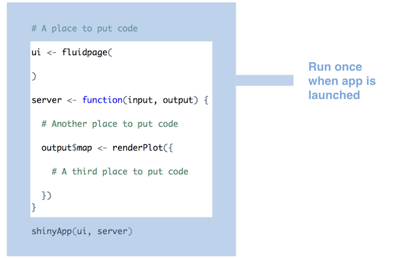

```{r setup, include=FALSE}
source("R/setup-xaringan.R")
```


```{r, child="readme.md"}
```

---

# Ejercicio: Juntando inputs, laytous, htmlwidgets, {bslib}

Recuerde el ejercicio de la clase pasada: Generar una aplicación que considere/tenga:

- El app debe ser generada con un `navbarPage` (con una única sección `tabPanel`)
- En la única sección considere un `sidebarPanel`.
- La aplicación debe poseer un selector de fecha.
- Dada una fecha, la aplicación muestre una tabla con la información
de sismos de la fecha asociada y un mapa. Ayúdese generando una función 
para descargar la información dada una fecha.
- Adicionalmente un _leaflet_ con la ubicación de los sismos.
- Incorpore texto con información de la fecha seleccionada.

Adicionalmente:

- Incorpore la tabla de sismos a la aplicación con {DT}.
- Seleccione un retail, banco u otra marca de su preferencia y realice
el ejercicio de incorporar los colores y tipografías. Utilizando
`bs_theme(..., primary = color, "navbar-light-bg" = otrocolor)`

---

# Solución

.pull-left[.code40[
```r
library(shiny);library(leaflet);library(rvest);library(dplyr);library(janitor)
library(tidyverse);library(lubridate);library(DT);library(bslib)

descarga_sismos_por_dia <- function(fecha_string){
  message(fecha_string)
  fecha <- ymd(fecha_string)
  y <- year(fecha)
  m <- format(fecha, "%m")  
  d <- format(fecha, "%Y%m%d")  
  url <- str_glue("https://www.sismologia.cl/sismicidad/catalogo/{y}/{m}/{d}.html")
  datos <- read_html(url) |>
    html_table() |>
    dplyr::nth(2) |>
    janitor::clean_names() |>
    tidyr::separate(latitud_longitud, into = c("latitud", "longitud"), sep = " ", convert = TRUE)
  datos
}

ui <- navbarPage(
  theme = bs_theme("navbar-light-bg"  = "#002884", primary = "#5583ff", base_font = font_google("Nunito")),
  tags$span("Sismos en ", tags$img(src = "https://portales.bancochile.cl/uploads/000/035/565/2ca8e2c5-606c-47f4-80ef-03bec528775d/original/bch-inverse.svg"),  
  ),
  tabPanel("Sismos",
    sidebarLayout(
      sidebarPanel(
        dateInput("fecha", label = h5("Seleccione fecha por favor"), max = Sys.Date()),
        actionButton("primary", "Primary", icon("r-project"), class = "btn-primary")
      ),
      mainPanel(
        fluidRow(
          column(width = 4, leafletOutput("mapa")),
          column(width = 8, DTOutput("tabla"))
        )
      )
    )
  )
)

```
]]
.pull-right[.code60[
```r
server <- function(input, output){
  
  output$mapa <- renderLeaflet({
    datos <- descarga_sismos_por_dia(input$fecha)
    leaflet(datos) |>
      addTiles() |>
      addMarkers(
        lng = ~longitud,
        lat = ~latitud,
        popup = ~as.character(magnitud_2),
        label = ~as.character(`fecha_local_lugar`)
      )
  })
  
  output$tabla <- renderDataTable({
    datos <- descarga_sismos_por_dia(input$fecha)
    datatable(datos)
  })
  
}

shinyApp(ui, server)
```
]]


---

class: center, middle, inverse

# Expresiones reactivas

---

# Expresiones reactivas (_reactive expressions_)


.pull-left[
La idea de expresiones reactiva es que podemos limitar que es lo que se (re)ejecuta al cambiar un input.

Una expresión reactiva es código R que usa un input y retorna un valor, 
la expresion se actualizará cuando el valor del (de los) inputs de los cuales dependen
cambien.

Estos elementos se definen en el `server`. Se crea una expresion con la función `reactive` la que toma una expresión/código R entre `{}`, de la misma forma que las funciones `render` (`renderPlot`, `renderTable`):

```
server <- function(input, output) {
  ...
  elementoReactivo <- reactive({
    codigo R...
  })
  ...

} 
```

]

.pull-right[
```r
server <- function(input, output) {
  
  dataSismos <- reactive({
    fecha <- ymd(input$fecha)
    ...
    datos <- read_html(url) |>
      html_table() |> ...
    datos
    
  })
  
  output$mapa <- renderLeaflet({
    
    datos <- dataSismos()
    
    leaflet(datos) |> ...
  })
  
  output$tabla <- renderDT({
    datatable(dataSismos())
  })
  
})
```
]

---

# Expresiones reactivas: Ejemplo

.center[

]

---

# Expresiones reactivas: Ejemplo _mejorado_

.center[

]

---

# Ejercicio: Creando una expresión reactiva

Para el ejercicio anterior:

- Cree la expresión reactiva necesaria para reducir la cantidad de descargas.

- Incluya un `sliderInput` para filtrar los registros de la tabla (no así los registros/markers del mapa).

---

# Solución

.pull-left[.code40[
```r
library(shiny);library(leaflet);library(rvest);library(dplyr);library(janitor)
library(tidyverse);library(lubridate);library(DT);library(bslib)

descarga_sismos_por_dia <- function(fecha_string){
  message(fecha_string)
  fecha <- ymd(fecha_string)
  y <- year(fecha)
  m <- format(fecha, "%m")  
  d <- format(fecha, "%Y%m%d")  
  url <- str_glue("https://www.sismologia.cl/sismicidad/catalogo/{y}/{m}/{d}.html")
  datos <- read_html(url) |>
    html_table() |>
    dplyr::nth(2) |>
    janitor::clean_names() |>
    tidyr::separate(latitud_longitud, into = c("latitud", "longitud"), sep = " ", convert = TRUE) |> 
    mutate(magnitud_3 = as.numeric(str_remove(magnitud_2, " Ml")))
  datos
}

ui <- navbarPage(
  theme = bs_theme("navbar-light-bg"  = "#002884", primary = "#5583ff", base_font = font_google("Nunito")),
  tags$span("Sismos en ", tags$img(src = "https://portales.bancochile.cl/uploads/000/035/565/2ca8e2c5-606c-47f4-80ef-03bec528775d/original/bch-inverse.svg"),  
  ),
  tabPanel("Sismos",
    sidebarLayout(
      sidebarPanel(
        dateInput("fecha", label = h5("Seleccione fecha por favor"), max = Sys.Date()),
        sliderInput("filtro_magnitud", label = "filtrar magnitud", min = 3, max = 10, value = 10),
        actionButton("primary", "Primary", icon("r-project"), class = "btn-primary")
      ),
      mainPanel(
        fluidRow(
          column(width = 4, leafletOutput("mapa")),
          column(width = 8, DTOutput("tabla"))
        )
      )
    )
  )
)

```
]]
.pull-right[.code60[
```r
server <- function(input, output){
  
  dataSismos <- reactive({
    datos <- descarga_sismos_por_dia(input$fecha)
    datos
  })
  
  output$mapa <- renderLeaflet({
    datos <- dataSismos()
    leaflet(datos) |>
      addTiles() |>
      addMarkers(
        lng = ~longitud,
        lat = ~latitud,
        popup = ~as.character(magnitud_2),
        label = ~as.character(`fecha_local_lugar`)
      )
  })
  
  output$tabla <- renderDataTable({
    datos <- dataSismos()
    mmax <- input$filtro_magnitud
    datos_filtrados <- datos |> 
      filter(magnitud_3 <= mmax) |> 
      select(-magnitud_3)
    datatable(datos_filtrados)
  })
  
}

shinyApp(ui, server)
```
]]

---

class: center, middle, inverse

# Orden de ejecución

---

# Una vez 

.center[
```{r echo = FALSE, out.width = "70%" }

```
]

---

# Una vez por usuario

.center[
```{r echo = FALSE, out.width = "70%" }
knitr::include_graphics("imgs/run-once-per-user.png")
```
]

---

# Muchas veces

.center[
```{r echo = FALSE, out.width = "70%" }
knitr::include_graphics("imgs/run-many-times.png")
```
]

---

class: center, middle, inverse

# Extensiones para Shiny

---

# Extensiones para Shiny

Podemos decir que ya existe un _shinyverso_ dada la cantidad de paquetes
que extienden shiny, agregando tanto diseños, nuevas funcionalidades, etc:

https://github.com/nanxstats/awesome-shiny-extensions

Menciones honrosas (_en mi opinión_):

- https://rinterface.github.io/shinydashboardPlus/

- https://fullpage.rinterface.com/

- https://waiter.john-coene.com/

- https://cicerone.john-coene.com/


---

# Ejercicio: Incorporando extensiones

Para el ejercicio incluya las características de {waiter} y {ciceroene}

---

# Solución

---

# Cosas que no vimos...

... Que ni tan necesarias, pero que en futuro podrían ayudar!


- `bindCache`: Se puede asociar un resultado de un `render` a ciertos inputs, para guardar automáticament el resultado sin tener que volver a ejecutar el código dentro del `render`. 
https://shiny.rstudio.com/articles/caching.html

- Bookmarking: La posibilidad de registrar la aplicación con ciertos inputs seleccionados.
Como cuando comparter una aplicación de un retail con ciertos filtros. https://mastering-shiny.org/action-bookmark.html

- HTMLWidgets Proxys: Características de algunos HTMLWidgets para no _recontruir_ el gráfico sino que actualizarlo. 
