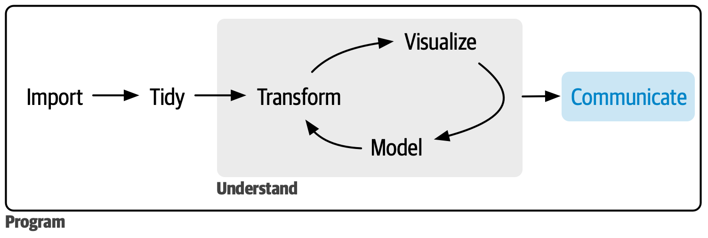

```{r setup, include=FALSE}
source("R/setup-xaringan.R")
knitr::opts_chunk$set(warning = FALSE, message = FALSE, fig.path = "imgs/slides1/")
```


```{r, child="readme.md"}
```


---

class: center, middle, inverse

# Antes de Partir

---

# Antes de Partir

La prestación podrá acceder desde https://jkunst.com/shiny-visualizacion-de-datos-con-R/clase-01.html y el código fuente, apps, ejemplos en https://github.com/jbkunst/shiny-visualizacion-de-datos-con-R

<br>

Asumimos que tenemos conocimiento de como funciona R, paquetes, funciones, etc.

No es necesario en `shiny` pero usaremos los paquetes `dplyr` y `ggplot2` principalmente
para hacer manipulación y visualización de los datos.

Necesitaremos algunos paquetes: 

```{r, eval=FALSE}
install.packages(
  c("tidyverse", "shiny", "shinythemes", "shinyWidgets", "bslib",
    "shinydashboard", "DT", "leaflet", "plotly", "highcharter",
    "forecast", "janitor")
  )
```

---

# Ayuda

No olvidar que una buena forma de aprender es con la documentación oficial:

- https://shiny.posit.co/
- https://mastering-shiny.org/
- https://shiny.posit.co/r/getstarted/shiny-basics/lesson1/


---

# Por que shiny?

<br/>

<br/>

.center[
```{r, out.width = "800px", echo=FALSE}

```
]

---

# Por que shiny?

<br/>

- **De script a app en minutos**. Lo que ya tienes en R/Python lo envuelves en una interfaz sin crear APIs ni reescribir lógica.

<br/>

- **Sin cambiar de lenguaje ni stack**. Sigues usando R/Python — no necesitas aprender React, JS, Flask, Django, etc.

<br/>

- **Interactividad analítica inmediata**. La reactividad está integrada: los outputs se actualizan solos al cambiar los inputs.

---

class: center, middle, inverse

# ¿Qué es una __app__(licación) web?

---

# Aplicación Web

(Wikipedia:) Herramientas que los usuarios pueden utilizar accediendo 
a un servidor web a través de internet o de una intranet mediante un navegador.

Puede ser de lo más simple:

.center[
```{r, echo=FALSE, out.width = "550px"}
knitr::include_graphics("imgs/miprimerappbslib.png")
```
]
---

# Aplicación Web

Hasta algo más complejo con más `input`s y `output`s:

<!--  -->

.center[
```{r, out.width = "800px", echo=FALSE}
knitr::include_graphics("imgs/otraapp2.png")
```
]

---

# Ejemplos para motivarse!

<br/>

Algunos simples.

* https://jjallaire.shinyapps.io/shiny-kmeans/
* https://jbkunst.shinyapps.io/bias-variance/
(https://github.com/jbkunst/shiny-apps-educational apps para la educación)
<br/>

Otros con más detalle en la parte visual.

* Índice de Digitalización Comunal https://www.nudos.cl/ https://indice.nudos.cl/
* Observatorio de Sequía https://odes-chile.org/ https://odes-chile.org/app/unidades/
* Chatbot demo https://jbkunst.shinyapps.io/shiny-sidebot-demo-school/ https://jbkunst.shinyapps.io/shiny-sidebot-demo/
* Sustainability Science Metrics Viewer https://sna-ses.shinyapps.io/SSMviewer
* Trade Statistics https://jbkunst.shinyapps.io/trd-sttstcs/ (https://github.com/jbkunst/trd-sttstcs)
* https://jorgehcas1998.shinyapps.io/Dataton-app/ (https://github.com/socapal/dataton-tudinero)
* https://nz-stefan.shinyapps.io/commute-explorer-2

---

# La estructura de una ShinyApp

<br>

```{r, eval=FALSE}
library(shiny)
library(bslib) # Shiny incluye el paquete bslib, que usaremos para crear interfaces

ui <- page_fluid()

server <- function(input, output) {}

shinyApp(ui, server)
```

<br>

En `shiny`, una aplicación constará de **2** partes:

- La interfaz de usuario, `ui` (user interface), donde definiremos el look de nuestra aplicación, y lugar de  `inputs` y `outputs`.
- El `server`, en donde especificaremos como interactuan los `outputs` en función de los `inputs`.

---

# La estructura de una ShinyApp

<br>


```{r, eval=FALSE}
library(shiny)
library(bslib)

ui <- page_fluid()                            #<<

server <- function(input, output) {}

shinyApp(ui, server)
```


<br>

- Se define una interfaz de usuario (user interface). En adelante `ui`.
- En este caso es una página fluida vacía `page_fluid()`.
- En el futuro acá definiremos diseño/estructura de nuestra aplicación (_layout_).
Que se refiere la disposición de nuestros `inputs` y `outputs`.

---

# La estructura de una ShinyApp

<br>

```{r, eval=FALSE}
library(shiny)
library(bslib)

ui <- page_fluid()                            

server <- function(input, output) {}         #<<

shinyApp(ui, server)
```

<br>

- Se define el `server` en donde estará toda la lógica de nuestra aplicación.
- Principalmente serán instrucciones que dependeran de `inputs` y
reflejaremos `outputs`: como tablas, gráficos.


---

# La estructura de una ShinyApp

<br>

```{r, eval=FALSE}
library(shiny)
library(bslib)

ui <- page_fluid()                            

server <- function(input, output) {}         

shinyApp(ui, server)             #<<
```

<br>

- `shinyApp` es la funcion que crea y deja corriendo la app con los 
parámetros otorgados.
- **No siempre** tendremos que escribirla pues veremos que RStudio
al crear una shinyApp nos pondrá un botón para _servir_ la aplicación.


---

# La estructura de una ShinyApp

<br>

```{r, eval=FALSE}
library(shiny)
library(bslib)

ui <- page_fluid()                            

server <- function(input, output) {}         

shinyApp(ui, server)    
```

De formar general la aplicación será:

```{r, eval=FALSE}
library(shiny)
library(bslib)
# acá se cargarán paquetes y también datos necesarios

ui <- page_fluid(
  # código que da forma a nuestrá aplicación: títulos, secciones, textos, inputs
)                            

server <- function(input, output) {
  # toooda la lógica de como interactuan los outputs en función de los inputs
}         
```

---

# Repaso R: Que hace el siguiente código?

<br>

```{r quehace, eval=FALSE}
set.seed(123)

x <- rnorm(10)
x

t <- ifelse(TRUE, "b", "l")
t

c <- "darkred"
c

plot(x, type = t, col = c)    
```

---

`r flipbookr::chunk_reveal("quehace", title = "# Repaso R: Que hace el siguiente código?", chunk_options = "fig.height = 5")`

---

`r flipbookr::chunk_reveal("quehace2", title = "# Repaso R: Que hace el siguiente código?", chunk_options = "fig.height = 5")`

```{r quehace2, eval=FALSE}
set.seed(123)

x <- rnorm(50)
x

t <- ifelse(FALSE, "b", "l")
t

c <- "green"
c

plot(x, type = t, col = c)    
```

---

# Ejercicio: Nuestra primer App

Hacer funcionar el siguiente `código` en R Rstudio: (hint: sí, copy + paste + run).

Note que al *guardar* el script Rstudio lo reconoce como app y aparece un botón de RUN.

.code70[
```{r, eval=FALSE}
library(shiny)
library(bslib)

ui <- page_sidebar(
  title = "Mi primer app",
  sidebar = sidebar(
    sliderInput("nrand", "Simulaciones", min = 50, max = 100, value = 70),
    selectInput("col", "Color", c("red", "blue", "black")),
    checkboxInput("punto", "Puntos:", value = FALSE)
    ),
  plotOutput("grafico")
  )

server <- function(input, output) {
   output$grafico <- renderPlot({
     set.seed(123)
     x <- rnorm(input$nrand)
     t <- ifelse(input$punto, "b", "l")
     plot(x, type = t, col = input$col)
   })
}

shinyApp(ui, server)
```
]

---

# Si quieres más ejemplos 

```{r, eval=FALSE}
shiny::runExample("01_hello")      # un histograma
shiny::runExample("02_text")       # tablas y data frames
shiny::runExample("03_reactivity") # una expresión reactiva
shiny::runExample("04_mpg")        # variables globales
shiny::runExample("05_sliders")    # controles deslizantes (sliders)
shiny::runExample("06_tabsets")    # paneles con pestañas (tabs)
shiny::runExample("07_widgets")    # texto de ayuda y botones de envío
shiny::runExample("08_html")       # app Shiny construida desde HTML
shiny::runExample("09_upload")     # asistente para subir archivos
shiny::runExample("10_download")   # asistente para descargar archivos
shiny::runExample("11_timer")      # temporizador automático
```

---

class: center, middle, inverse

# Funcionamiento de una app de Shiny

---

# App


---

# Página/layout 


---

# Elementos 


---

# Inputs 


---

# Output(s)


---

# Obtener valores en el *ui* del usuario el *server*


---

# Resultado de *server* a *ui*


---

# El funcionamiento de una ShinyApp


.code60[
```{r, eval=FALSE}
ui <- page_sidebar(
  title = "Mi primer app",
  sidebar = sidebar(
    sliderInput("nrand", "Simulaciones", min = 50, max = 100, value = 70),
    selectInput("col", "Color", c("red", "blue", "black")),
    checkboxInput("punto", "Puntos:", value = FALSE)
    ),
  plotOutput("grafico")
  )

server <- function(input, output) {
   output$grafico <- renderPlot({
     set.seed(123)
     x <- rnorm(input$nrand)
     t <- ifelse(input$punto, "b", "l")
     plot(x, type = t, col = input$col)
   })
}
```
]

---

# El funcionamiento de una ShinyApp

.code60[
```{r, eval=FALSE}
ui <- page_sidebar(                                                  #<<                                
  title = "Mi primer app",
  sidebar = sidebar(                                                 #<<
    sliderInput("nrand", "Simulaciones", min = 50, max = 100, value = 70),
    selectInput("col", "Color", c("red", "blue", "black")),
    checkboxInput("punto", "Puntos:", value = FALSE)
    ),
  plotOutput("grafico")                           
  )

server <- function(input, output) {
   output$grafico <- renderPlot({
     set.seed(123)
     x <- rnorm(input$nrand)
     t <- ifelse(input$punto, "b", "l")
     plot(x, type = t, col = input$col)
   })
}
``` 
]

- `page_sidebar`, `page_fluid`, `sidebar`, definen el diseño/_layout_ de nuestra
app.
-  Existen muchas más formas de organizar una app: Por ejemplo uso de _tabs_ de _menus_, o páginas
con navegación. Más detalles http://shiny.rstudio.com/articles/layout-guide.html.


---

# El funcionamiento de una ShinyApp

.code60[
```{r, eval=FALSE}
ui <- page_sidebar(
  title = "Mi primer app",
  sidebar = sidebar(
    sliderInput("nrand", "Simulaciones", min = 50, max = 100, value = 70),             #<<
    selectInput("col", "Color", c("red", "blue", "black")),   #<<
    checkboxInput("punto", "Puntos:", value = FALSE)          #<<
    ),
  plotOutput("grafico")
  )

server <- function(input, output) {
   output$grafico <- renderPlot({
     set.seed(123)
     x <- rnorm(input$nrand)
     t <- ifelse(input$punto, "b", "l")
     plot(x, type = t, col = input$col)
   })
}
``` 
]

- `sliderInput`, `selectInput`, `checkboxInput` son los inputs de nuestra app,
con esto el usuario puede interactuar con nuestra aplicación (https://shiny.rstudio.com/gallery/widget-gallery.html).
- Estas funciones generan el input deseado en la app y shiny perminte que los
valores de estos inputs sean usados como valores usuales en R en la parte del server
(numericos, strings, booleanos, fechas).

---

# El funcionamiento de una ShinyApp

.code60[
```{r, eval=FALSE}
ui <- page_sidebar(
  title = "Mi primer app",
  sidebar = sidebar(
    sliderInput("nrand", "Simulaciones", min = 50, max = 100, value = 70),             
    selectInput("col", "Color", c("red", "blue", "black")),   
    checkboxInput("punto", "Puntos:", value = FALSE)
    ),
  plotOutput("grafico")                            #<<                       
  )

server <- function(input, output) {
   output$grafico <- renderPlot({
     set.seed(123)
     x <- rnorm(input$nrand)
     t <- ifelse(input$punto, "b", "l")
     plot(x, type = t, col = input$col)
   })
}
``` 
]

- `plotOutput` define el lugar donde la salida estará.
- Como mencionamos, nuestras app ueden tener muchos outputs: tablas, texto, imágenes.


---

# El funcionamiento de una ShinyApp

.code60[
```{r, eval=FALSE}
ui <- page_sidebar(
  title = "Mi primer app",
  sidebar = sidebar(
    sliderInput("nrand", "Simulaciones", min = 50, max = 100, value = 70),             
    selectInput("col", "Color", c("red", "blue", "black")),   
    checkboxInput("punto", "Puntos:", value = FALSE)
    ),
  plotOutput("grafico")
  )

server <- function(input, output) {
   output$grafico <- renderPlot({                               #<<
     set.seed(123)
     x <- rnorm(input$nrand)
     t <- ifelse(input$punto, "b", "l")
     plot(x, type = t, col = input$col)
   })
}
``` 
]

- `renderPlot` define un tipo de salida gráfica.
- Existen otros tipos de salidas, como tablas `tableOutput` o tablas más interactivas como 
`DT::DTOutput`.


---

# El funcionamiento de una ShinyApp

.code60[
```{r, eval=FALSE}
ui <- page_sidebar(
  title = "Mi primer app",
  sidebar = sidebar(
    sliderInput("nrand", "Simulaciones", min = 50, max = 100, value = 70),             
    selectInput("col", "Color", c("red", "blue", "black")),   
    checkboxInput("punto", "Puntos:", value = FALSE)
    ),
  plotOutput("grafico")
  )

server <- function(input, output) {
   output$grafico <- renderPlot({                               
     set.seed(123)                                              #<<
     x <- rnorm(input$nrand)                                    #<<
     t <- ifelse(input$punto, "b", "l")                         #<<
     plot(x, type = t, col = input$col)                         #<<
   })
}
``` 
]

- Este espacio determina la lógica de nuestra salida.
- Acá haremos uso de los inputs para entregar lo que deseamos.

---

# El funcionamiento de una ShinyApp

.code60[
<pre class="r hljs remark-code">
ui <- page_sidebar(
  title = "Mi primer app",
  sidebar = sidebar(
    sliderInput("nrand", "Simulaciones", min = 50, max = 100, value = 70),             
    selectInput("col", "Color", c("red", "blue", "black")),   
    checkboxInput("punto", "Puntos:", value = FALSE)
    ),
  plotOutput("grafico")
  )

server <- function(input, output) {
   output$grafico <- <b>renderPlot</b>({                               
     set.seed(123)                                              
     x <- rnorm(input$nrand)                                    
     t <- ifelse(input$punto, "b", "l")                         
     plot(x, type = t, col = input$col)                         
   })
}
</pre>
]

- Las funciones `*Output()` y `render*()`  trabajan juntas para agregar salidas de R a la
interfaz de usuario
- En este caso `renderPlot` esta asociado con `plotOutput` (¿cómo?)
- Hay muchas parejas como `renderText`/`textOutput` o `renderTable`/`tableOutput` entre
otras (revisar la sección de outputs en el cheat sheet)
 
 
---

# El funcionamiento de una ShinyApp

.code60[
<pre class="r hljs remark-code">
ui <- page_sidebar(
  title = "Mi primer app",
  sidebar = sidebar(
    sliderInput("nrand", "Simulaciones", min = 50, max = 100, value = 70),             
    selectInput("col", "Color", c("red", "blue", "black")),   
    checkboxInput("punto", "Puntos:", value = FALSE)
    ),
  plotOutput("grafico")
  )

server <- function(input, output) {
   output$<b>grafico</b> <- renderPlot({                               
     set.seed(123)                                              
     x <- rnorm(input$nrand)                                    
     t <- ifelse(input$punto, "b", "l")                         
     plot(x, type = t, col = input$col)                         
   })
}
</pre>
]

- Cada `*Output()` y `render*()` se asocian con un **id** definido por nosotros
- Este **id** debe ser único en la applicación
- En el ejemplo `renderPlot` esta asociado con `plotOutput` vía el id `grafico`

---

# El funcionamiento de una ShinyApp

.code60[
<pre class="r hljs remark-code">
ui <- page_sidebar(
  title = "Mi primer app",
  sidebar = sidebar(
    sliderInput("nrand", "Simulaciones", min = 50, max = 100, value = 70),             
    selectInput("col", "Color", c("red", "blue", "black")),   
    checkboxInput("punto", "Puntos:", value = FALSE)
    ),
  plotOutput("grafico")
  )

server <- function(input, output) {
   output$grafico <- renderPlot({                               
     set.seed(123)                                              
     x <- rnorm(input$<b>nrand</b>)                                    
     t <- ifelse(input$punto, "b", "l")                         
     plot(x, type = t, col = input$col)                         
   })
}
</pre>
]

- Cada functión `*Input` requiere un **id** para ser identificado en el server
- Cada `*Input` requiere argumentos especificos a cada tipo de input, valor por defecto,
etiquetas, opciones, rangos, etc
- Acá, el valor númerico ingresado/modifcado por el usuario se puede 
acceder en el server bajo `input$nrand`


---

# El funcionamiento de una ShinyApp

.code60[
<pre class="r hljs remark-code">
ui <- page_sidebar(
  title = "Mi primer app",
  sidebar = sidebar(
    sliderInput("nrand", "Simulaciones", min = 50, max = 100, value = 70),             
    selectInput("col", "Color", c("red", "blue", "black")),   
    checkboxInput("punto", "Puntos:", value = FALSE)
    ),
  plotOutput("grafico")
  )

server <- function(input, output) {
   output$grafico <- renderPlot({                               
     set.seed(123)                                              
     x <- rnorm(input$<b>nrand</b>)                                    
     t <- ifelse(input$<b>punto</b>, "b", "l")                         
     plot(x, type = t, col = input$<b>col</b>)                         
   })
}
</pre>
]

- `sliderInput` se usa para seleccionar un valor numérico entre un rango 
- `selectInput` otorga la posibildad que el usuario escoge entre un conjunto de valores
- `checkboxInput` en el server es un valor lógico `TRUE`/`FALSE`
- ¿Necesitas más? https://gallery.shinyapps.io/065-update-input-demo/ y http://shinyapps.dreamrs.fr/shinyWidgets/ 

---

# Agregando más *output*s

.code60[
```{r, eval=FALSE}
library(shiny)
library(bslib)

datos <- rnorm(100)                                            #<<

ui <- page_sidebar(
  title = "Mi primer app",
  sidebar = sidebar(
    sliderInput("nrand", "Simulaciones", min = 50, max = 100, value = 70),             
    selectInput("col", "Color", c("red", "blue", "black")),   
    checkboxInput("punto", "Puntos:", value = FALSE)
    ),
  plotOutput("grafico")
  )

server <- function(input, output) {
  output$grafico <- renderPlot({                               
    plot(head(datos, input$nrand), type =  ifelse(input$punto, "b", "l"), col = input$col) #<<
  })
}

shinyApp(ui, server)
``` 
]

- Asumamos que tenemos informacion en la variable `datos` y hemos reducido lineas para la parte del primer gráfico.
- Para agregar más outputs se deben incorporar el elemento output en el `ui` y luego el bloque de código asociado en el server como `output$id_del_output`.

---

# Agregando más *output*s

.code60[
```{r, eval=FALSE}
library(shiny)
library(bslib)

datos <- rnorm(100)

ui <- page_sidebar(
  title = "Mi primer app",
  sidebar = sidebar(
    sliderInput("nrand", "Simulaciones", min = 50, max = 100, value = 70),             
    selectInput("col", "Color", c("red", "blue", "black")),   
    checkboxInput("punto", "Puntos:", value = FALSE)
    ),
  plotOutput("grafico"),
  plotOutput("grafico2"),  #<<
  tableOutput("tabla")     #<<
  )

server <- function(input, output) {
  output$grafico <- renderPlot({                               
    plot(head(datos, input$nrand), type =  ifelse(input$punto, "b", "l"), col = input$col)
  })
  
  output$grafico2 <- renderPlot({                   #<<            
    hist(head(datos, input$nrand), col = input$col) #<<
  })                                                #<<
  
  output$tabla <- renderTable({             #<< 
    x <- head(datos, input$nrand)           #<<
    data.frame(mean(x), sd(x), length(x))   #<<
  })                                        #<<
  
}

shinyApp(ui, server)
``` 
]

---

# Agregando más *output*s

Es importante recordar:

- Los ids deben ser únicos.
- El tipo de cada output.
- No necesariamente debemos utilizar *todos* los inputs en cada output, por ejemplo la tabla no utiliza el color ni el si es punto/línea.
- Se pueden crear variables *intermedias* en cada bloque de output.
- Cada output retornará lo definido en la última línea de su bloque.

---

# Ejercicio: Inputs y outputs vengan a mi!

Modifiquemos la última versión de la aplicación para que contenga:
  - 2 inputs, un `sliderInput` y un `textInput` 
  - 3 outputs de tipo texto `textOutput` donde:
    1. El primero contenga simplemenbte el valor del primer input
    2. El segundo el valor del segundo input, y
    3. El tercero la suma de los dos inputs.


---

# Solucion 

.code60[
<pre class="r hljs remark-code">
library(shiny)
library(bslib)
                                      
ui <- page_sidebar(
  title = "Mi primer app",
  sidebar = sidebar(
    sliderInput("numerouno", "numero 1", min = 50, max = 100, value = 70),             
    textInput("numerodos", "#2", value = 3)
  ),
  textOutput("resultado1"),
  textOutput("resultado2"),
  textOutput("resultado3")
)

server <- function(input, output) {
  
  output$resultado1 <- renderText({
    x <- input$numerouno
    x
  })
  
  output$resultado2 <- renderText({
    input$numerodos
  })
  
  output$resultado3 <- renderText({
    input$numerouno + input$numerodos
  })
  
}

shinyApp(ui, server)
</pre>
]

---

# Solucion (ver. 2)

.code60[
<pre class="r hljs remark-code">
library(shiny)
library(bslib)
                                      
ui <- page_sidebar(
  title = "Mi primer app",
  sidebar = sidebar(
    sliderInput("numerouno", "numero 1", min = 50, max = 100, value = 70),             
    numericInput("numerodos", "#2", value = 3)
  ),
  textOutput("resultado1"),
  textOutput("resultado2"),
  textOutput("resultado3")
)

server <- function(input, output) {
  
  output$resultado1 <- renderText({
    x <- input$numerouno
    x
  })
  
  output$resultado2 <- renderText({
    input$numerodos
  })
  
  output$resultado3 <- renderText({
    input$numerouno + as.numeric(input$numerodos)
  })
  
}

shinyApp(ui, server)
</pre>
]


---

# Reactividad: Como funciona shiny

Consideremos la aplicación del ejemplo anterior. 

Al cambiar un input -como lo es `input$numerouno` o `input$numerodos`- shiny
reconoce que expresiones (renders, como `renderText` en este caso) dependen
dichos elementos y vuelve a calcularlos a penas suceda el cambio.

.center[
```{r, out.width = "800px", echo=FALSE}
knitr::include_graphics("imgs/reactivity-ejemplo.png")
```
]

En este sentido, shiny funciona similar a excel.
