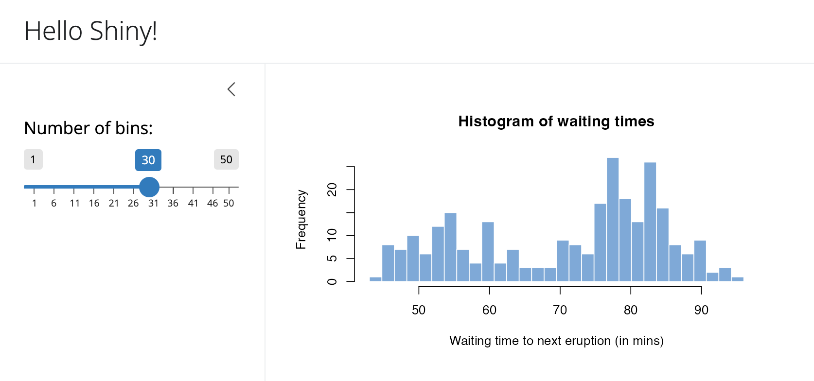
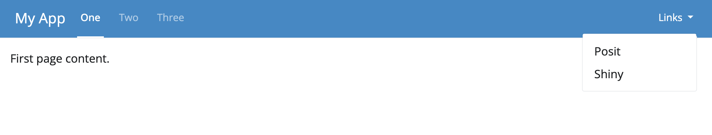
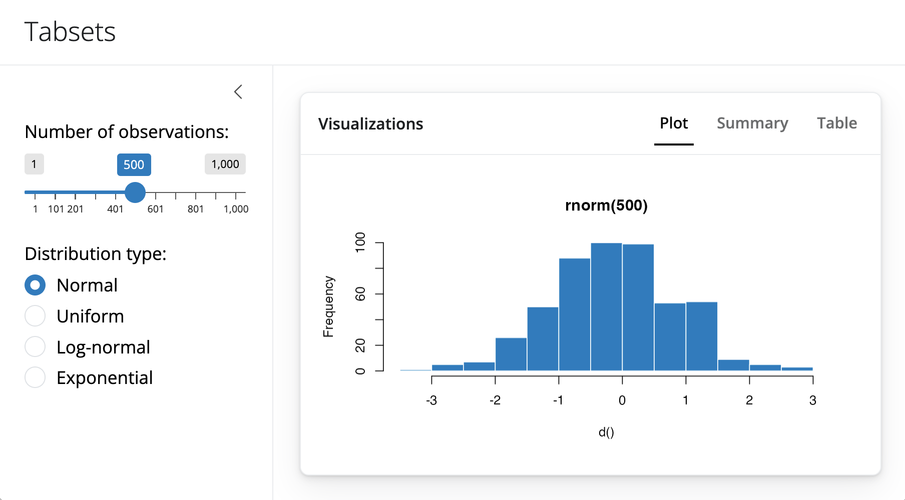
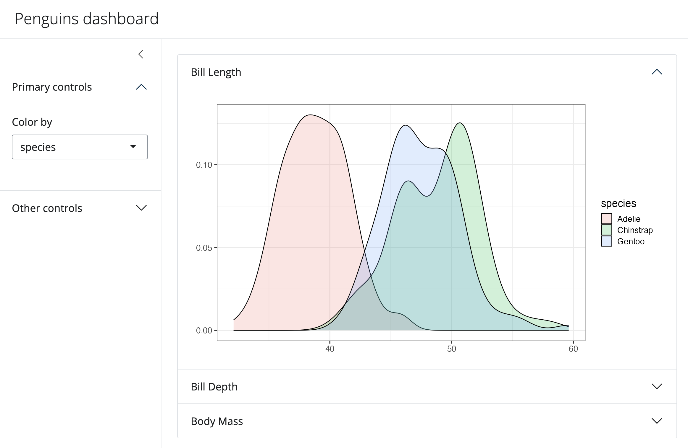
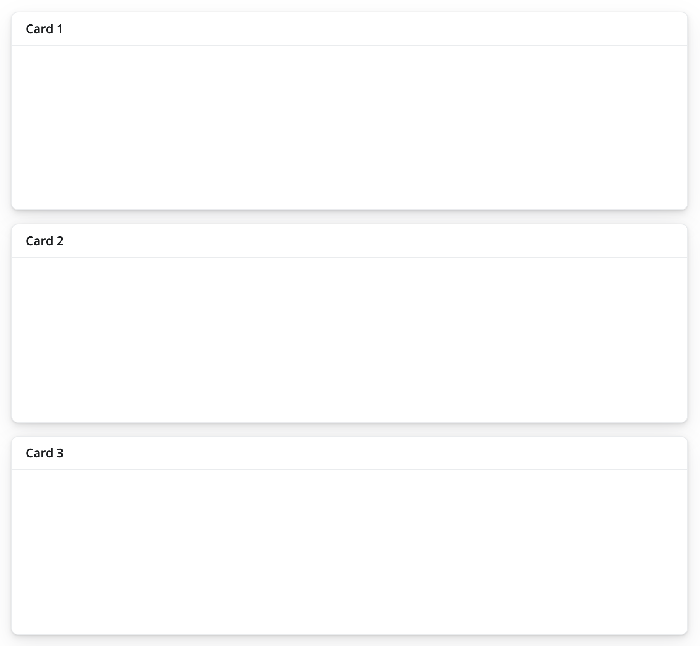
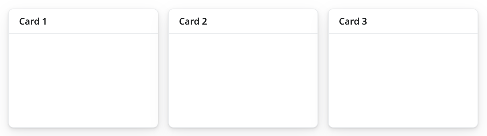
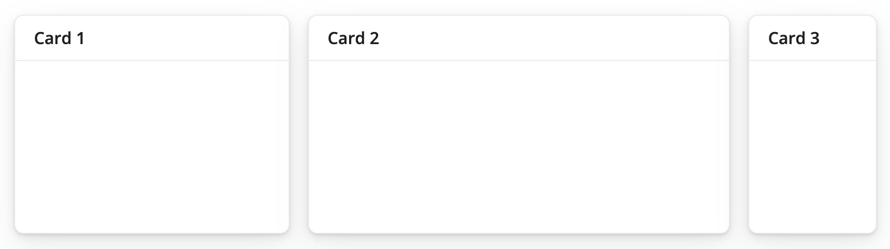
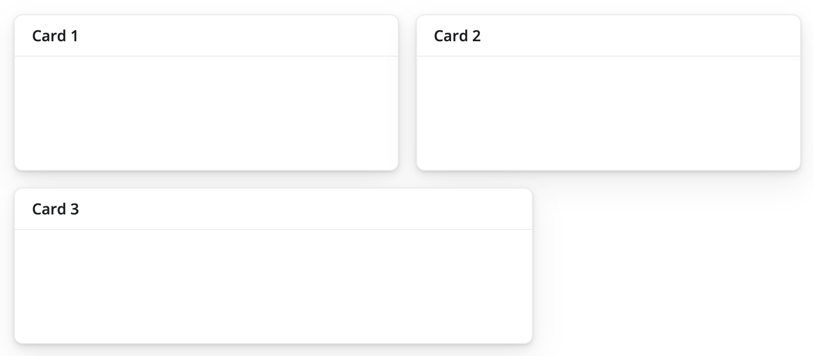
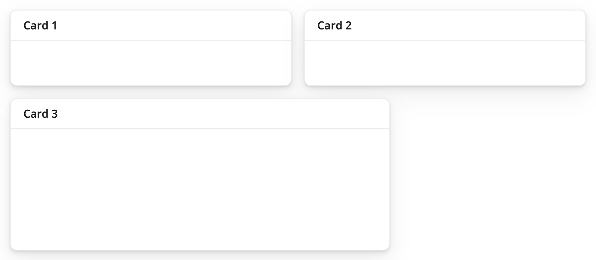
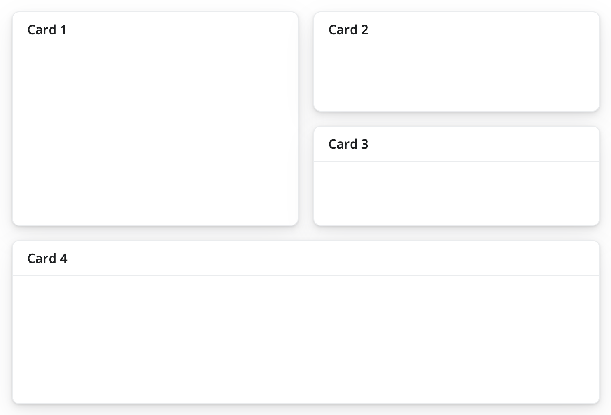

```{r setup, include=FALSE}
source("R/setup-xaringan.R")
knitr::opts_chunk$set(warning = FALSE, message = FALSE, fig.path = "imgs/slides2/")
```


```{r, child="readme.md"}
```

---

class: center, middle, inverse

# Layouts

---

# Layouts

.center[
```{r, out.width = "1000px", echo=FALSE}
knitr::include_graphics("imgs/layouts-thumb.jpg")
```
]


---

# Layouts

<br/>
Laytous se refiere a la disposición de elementos -como inputs, textos,
outputs- en nuestra app. Dependiendo de las necesidades puede ser convenientes algunos
tipos de layuts sobre otros.

--

<br/>
Revisemos el ejemplo *Chicago Flights* que viene en el paquete {bslib}:

```{r, eval=FALSE}
# install.packages(c("histoslider", "DT", "fontawesome", "bsicons", "pak"))
# pak::pak("cpsievert/chiflights22")

shiny::runApp(system.file("examples-shiny", "flights", package = "bslib"))
```


---

# Layouts


<br/>
Como mencionamos anteriormente utilizaremos para esto el paquete {bslib}.

--

<br/>
Lo importante es considerar que los elementos que revisaremos se pueden utilizar dentro de otros. La idea de armar un layout es generalmente anidar elementos.

--

<br/>
Acá nos centraremos solamente en el *ui* pues al modificar la disposición de los elementos no afectaremos al *server*.

---

# page_sidebar



---

# page_sidebar

.pull-left[
```{r, eval=FALSE}
library(shiny)
library(bslib)

ui <- page_sidebar(              #<<

  title = "Hello Shiny!",

  sidebar = sidebar(              #<<
    sliderInput(
      "bins", label = "Number of bins:",
      min = 1, value = 30, max = 50
    )
  ),

  plotOutput("distPlot")
)
```
<small>https://shiny.posit.co/r/articles/build/layout-guide/</small>
]

.pull-right[

]


---

# page_navbar



.code70[
```{r, eval=FALSE}
ui <- page_navbar(
  title = "My App",
  bg = "#2D89C8",
  inverse = TRUE,
  nav_panel(title = "One", p("First page content.")),
  nav_panel(title = "Two", p("Second page content.")),
  nav_panel(title = "Three", p("Third page content.")),
  nav_spacer(),
  nav_menu(
    title = "Links",
    align = "right",
    nav_item(tags$a("Posit", href = "https://posit.co")),
    nav_item(tags$a("Shiny", href = "https://shiny.posit.co"))
  )
)
```
]


---

# navset card underline/pill/tab

.pull-left[
```{r, eval=FALSE}
library(shiny)
library(bslib)

ui <- page_sidebar(
  title = "Tabsets",
  sidebar = sidebar(
    ...
  ),
  navset_card_underline(                                #<<
    title = "Visualizations",
    nav_panel("Plot", plotOutput("plot")),
    nav_panel("Summary", tableOutput("summary")),
    nav_panel("Table", tableOutput("table"))
  )
)
```
]

.pull-right[

]

---

# accordion

.pull-left[
```{r, eval=FALSE}
ui <- page_sidebar(
  title = "Penguins dashboard",
  sidebar = sidebar(
    accordion(                                #<<
      accordion_panel(
        "Primary controls",
        varSelectInput(...)
      ),
      accordion_panel(
        "Other controls",
        "Other controls go here"
      )
    )
  ),
  accordion(                                 #<<
    accordion_panel("Bill Length", plotOutput("p1")),
    accordion_panel("Bill Depth", plotOutput("p2")),
    accordion_panel("Body Mass", plotOutput("p3"))
  )
)
```

<small>https://shiny.posit.co/r/articles/build/layout-guide/</small>
]

.pull-right[

]


---

# Multiples columnas: Layout por filas

.pull-left[
`page_fillable()` permite crear una app sin barra lateral.
Los componentes dentro de page_fillable() se ajustan automáticamente para ocupar el espacio vertical y horizontal disponible.
Por defecto, Shiny coloca cada nuevo componente debajo del anterior, como si cada uno fuera una nueva fila.

```{r, eval=FALSE}
ui <- page_fillable(

  card(card_header("Card 1")),
  card(card_header("Card 2")),
  card(card_header("Card 3"))
  
)
```

]

.pull-right[

]

---

# Multiples columnas: Layout por columnas


.pull-left[
```{r, eval=FALSE}
ui <- page_fillable(

  layout_columns(         #<<
     card(card_header("Card 1")),
     card(card_header("Card 2")),
     card(card_header("Card 3"))
  )
  
)
```
]

.pull-right[

]

---

# Multiples columnas: Layout por columnas (anchos)


.pull-left[
```{r, eval=FALSE}
ui <- page_fillable(

  layout_columns(
     card(card_header("Card 1")),
     card(card_header("Card 2")),
     card(card_header("Card 3")),
     col_widths = c(4, 6, 2)            #<<
  )
  
)
```
]

.pull-right[

]

---

# Multiples columnas: Layout por columnas (anchos 2)

.pull-left[
```{r, eval=FALSE}
ui <- page_fillable(

  layout_columns(
     card(card_header("Card 1")),
     card(card_header("Card 2")),
     card(card_header("Card 3")),
     col_widths = c(6, 6, 8)  #<<
  )
  
)
```

Si los elementos superan las 12 unidades de ancho, automáticamente pasan a una nueva fila.

]

.pull-right[

]

---

# Multiples columnas: Distintas altos por filas


.pull-left[
```{r, eval=FALSE}
ui <- page_fillable(

  layout_columns(
     card(card_header("Card 1")),
     card(card_header("Card 2")),
     card(card_header("Card 3")),
     col_widths = c(6, 6, 8),
     row_heights = c(1, 2)        #<<
  )
  
)
```

Si los elementos superan las 12 unidades de ancho, automáticamente pasan a una nueva fila.

]

.pull-right[

]

---

# Multiples columnas: Layout mixto


.pull-left[
Se pueden combinar y anidarpara crear diseños personalizados basados en grillas.

```r
ui <- page_fillable(
  layout_columns(
    card(card_header("Card 1")),
    layout_columns(
      card(card_header("Card 2")),
      card(card_header("Card 3")),
      col_widths = c(12, 12)
      )
  ),
  card(card_header("Card 4"))
)
```
]

.pull-right[

]


---

# Ejercicio: Distribuyendo outputs

Tomar la siguiente app e implementar un `navset_card_*`, `accordion` y un layout mixto.

.pull-left[
.code70[
```{r, eval=FALSE}
# UI
library(shiny)
library(bslib)

datos <- rnorm(100)

ui <- page_sidebar(
  title = "Mi primera app",
  sidebar = sidebar(
    sliderInput("nrand", "Simulaciones", min = 50,
                max = 100, value = 70),             
    selectInput("col", "Color", c("red", "blue", "black")),   
    checkboxInput("punto", "Puntos:", value = FALSE)
    ),
  plotOutput("grafico"),
  plotOutput("grafico2"),  
  tableOutput("tabla")    
  )
``` 
]
]

.pull-right[
.code70[
```{r, eval=FALSE}
# Server
server <- function(input, output) {
  output$grafico <- renderPlot({
    plot(
      head(datos, input$nrand),
      type =  ifelse(input$punto, "b", "l"),
      col = input$col
      )
  })
  
  output$grafico2 <- renderPlot({                            
    hist(head(datos, input$nrand), col = input$col) 
  })                                               
  
  output$tabla <- renderTable({            
    x <- head(datos, input$nrand)           
    data.frame(mean(x), sd(x), length(x))  
  })                                       
  
}

shinyApp(ui, server)
``` 
]
]


---

# Ejercicio: Distribuyendo outputs (solución)

Solamente modificamos la `ui`. El resto de implementaciones son similares.

.pull-left[
.code70[
```{r, eval=FALSE}
# UI
library(shiny)
library(bslib)

datos <- rnorm(100)

ui <- page_sidebar(
  title = "Mi primera app",
  sidebar = sidebar(
    sliderInput("nrand", "Simulaciones", min = 50,
                max = 100, value = 70),             
    selectInput("col", "Color", c("red", "blue", "black")),   
    checkboxInput("punto", "Puntos:", value = FALSE)
    ),
  navset_card_underline(
    title = "Resultados",
    nav_panel("Lineas", plotOutput("grafico")),
    nav_panel("Histograma", plotOutput("grafico2")),
    nav_panel("Tabla", tableOutput("tabla"))
    )   
  )
``` 
]
]

.pull-right[
.code70[
```{r, eval=FALSE}
# Server
server <- function(input, output) {
  output$grafico <- renderPlot({
    plot(
      head(datos, input$nrand),
      type =  ifelse(input$punto, "b", "l"),
      col = input$col
      )
  })
  
  output$grafico2 <- renderPlot({                            
    hist(head(datos, input$nrand), col = input$col) 
  })                                               
  
  output$tabla <- renderTable({            
    x <- head(datos, input$nrand)           
    data.frame(mean(x), sd(x), length(x))  
  })                                       
  
}

shinyApp(ui, server)
``` 
]
]


---

class: center, middle, inverse

# HTMLWidgets

---

# HTMLWidgets

HTMLWidgets son un tipo de paquetes que nos permiten realizar visualizaciones en HTML
las cuales se pueden usar en (1) consola, (integrar) integrar con shiny y también (3) rmarkdown.

Existen una gran cantida de paquetes https://gallery.htmlwidgets.org/, y nos sirven 
para complementar nuestra aplicación. 

Cada paquete HTMLWidget tiene su propio set de funciones, el código utilizado  para hacer un gráfico en plotly no es el mismo (pero generalmente muy similar)
al utilizado en highcharter, echarts4r:

- https://plotly.com/r/
- https://jkunst.com/highcharter/
- https://echarts4r.john-coene.com/
- https://rstudio.github.io/leaflet/
- https://rstudio.github.io/DT/

Ejemplo de uso de script https://github.com/jbkunst/shiny-visualizacion-de-datos-con-R/blob/master/R/script-htmlwidgets.R 

---

`r flipbookr::chunk_reveal("ggplot2", title = "# Antes, un poco de {ggplot2}")`

```{r ggplot2, include = FALSE}
library(ggplot2)

data(iris)

ggplot(iris, aes(Sepal.Length, Sepal.Width)) +
  geom_point(aes(color = Species), size = 2.5) +
  scale_color_viridis_d(end = .9) +
  geom_smooth(method = "lm") +
  facet_wrap(vars(Species)) +
  theme_minimal()
```

---

# {plotly}

.pull-left[
```{r plotly, eval = FALSE}
library(ggplot2)
library(plotly)

data(iris)

p <- ggplot(iris, aes(Sepal.Length, Sepal.Width)) +
  geom_point(aes(color = Species), size = 2.5) +
  scale_color_viridis_d(end = .9) +
  geom_smooth(method = "lm") +
  facet_wrap(vars(Species)) +
  theme_minimal()

ggplotly(p)
```
]

.pull-right[
```{r ref.label='plotly', eval=TRUE, echo=FALSE}
```
]


---

# {highcharter}

.pull-left[
```{r highcharter, eval=FALSE}
library(highcharter)
library(forecast)

data("AirPassengers")

modelo <- forecast(auto.arima(AirPassengers))

hchart(modelo) |>
  hc_add_theme(hc_theme_hcrt()) |>
  hc_navigator(enabled = TRUE) |>
  hc_rangeSelector(enabled = TRUE) |>
  hc_title(text = "Proyección")
```
]

.pull-right[
```{r ref.label='highcharter', eval=TRUE, echo=FALSE}
```
]


---

# Unos datos

.pull-left[
```{r sismos, eval=FALSE}
library(rvest)   # descargar datos de paginas web

url <- "https://www.sismologia.cl/sismicidad/catalogo/2025/11/20251117.html"

datos <- read_html(url) |>
  html_table() |>
  dplyr::nth(2) |>
  janitor::clean_names() |>
  tidyr::separate(
    latitud_longitud,
    into = c("latitud", "longitud"),
    sep = " ", convert = TRUE
  )

datos
```
]

.pull-right[
```{r ref.label='sismos', eval=TRUE, echo=FALSE}
```
]


---

# {DT}

.pull-left[
```{r dt, eval=FALSE}
library(DT)

datatable(datos)
```
]

.pull-right[
```{r ref.label='dt', eval=TRUE, echo=FALSE}
```
]


---

# {leaflet}

.pull-left[
```{r leaflet, eval=FALSE}
library(leaflet)

leaflet(datos) |>
  addTiles() |>
  addMarkers(
    lng = ~longitud,
    lat = ~latitud,
    popup = ~as.character(magnitud_2),
    label = ~as.character(`fecha_local_lugar`)
  ) |>
  addProviderTiles("Esri.WorldImagery")
```
]

.pull-right[
```{r ref.label='leaflet', eval=TRUE, echo=FALSE}
```
]


---

# Pero como usar HTMLWidgets en nuestra App?

<br>

Cada uno de los HTMLWidgets presentados, en su documentación detallan 
como usarlos en una aplicación shiny.

De forma general en cada paquete existirá una función tipo:

- `*Output` para colocarla en el `ui`.
- `render*` para definirla en el `server`

A modo de ejemplo, el paquete `leaflet` tiene `leafletOutput()` y `renderLeaflet()`.

Los anterior está documentado en https://rstudio.github.io/leaflet/shiny.html.

---

# Ejercicio: Agregar un HTMLWidget a la app

A la aplicación de ejemplo del sidebar que se muestra a continuación, modificar para que sea un gráfico _interactivo_ usando el plaque {plotly} y el ejemplo https://plotly.com/r/histograms/.

.pull-left[
```{r, eval=FALSE}
library(shiny)
library(bslib)


ui <- page_sidebar(
  title = "Hello Shiny!",
  sidebar = sidebar(
    sliderInput(
      "bins", label = "Number of bins:",
      min = 1, value = 30, max = 50
    )
  ),
  plotOutput("distPlot")
)
```
]

.pull-right[
```{r, eval=FALSE}
server <- function(input, output) {
  
  output$distPlot <- renderPlot({
    
    x    <- faithful[, 2]
    bins <- seq(min(x), max(x), length.out = input$bins + 1)
    
    hist(
      x,
      breaks = bins,
      col = 'darkgray', border = 'white',
      xlab = 'Waiting time to next eruption (in mins)',
      main = 'Histogram of waiting times'
      )
      
    })
}

shinyApp(ui, server)
```
]

---

# Ejercicio: Agregar un HTMLWidget a la app (solución)

A la aplicación de ejemplo del sidebar que se muestra a continuación, modificar para que sea un gráfico _interactivo_ usando el plaque {plotly}.

.pull-left[
```{r, eval=FALSE}
library(shiny)
library(bslib)
library(plotly)             #<<

ui <- page_sidebar(
  title = "Hello Shiny!",
  sidebar = sidebar(
    sliderInput(
      "bins", label = "Number of bins:",
      min = 1, value = 30, max = 50
    )
  ),
  plotlyOutput("distPlot")      #<<
)
```
]

.pull-right[
```{r, eval=FALSE}
server <- function(input, output) {
  
  output$distPlot <- renderPlotly({         #<<
    
    x    <- faithful[, 2]
    bins <- list(start = min(x),  end = max(x),  size =  (max(x) - min(x))/input$bins)
    
    plot_ly(
      x = ~ x, type = "histogram",
      nbinsx = bins,
      marker = list(color = 'darkgray', line = list(color = 'white', width = 1))
    ) |>
      layout(
        xaxis = list(title = 'Waiting time to next eruption (in mins)'),
        title = 'Histogram of waiting times'
        )
}

shinyApp(ui, server)
```
]

---

# Ejercicio: Agregar + HTMLWidgets a la app

A la siguiente aplicación implementar HTMLWidgets

.pull-left[
.code70[
```{r, eval=FALSE}
# UI
library(shiny)
library(bslib)

datos <- rnorm(100)

ui <- page_sidebar(
  title = "Mi primera app",
  sidebar = sidebar(
    sliderInput("nrand", "Simulaciones", min = 50,
                max = 100, value = 70),             
    selectInput("col", "Color", c("red", "blue", "black")),   
    checkboxInput("punto", "Puntos:", value = FALSE)
    ),
  navset_card_underline(
    title = "Resultados",
    nav_panel("Lineas", plotOutput("grafico")),
    nav_panel("Histograma", plotOutput("grafico2")),
    nav_panel("Tabla", tableOutput("tabla"))
    )   
  )
``` 
]
]

.pull-right[
.code70[
```{r, eval=FALSE}
# Server
server <- function(input, output) {
  output$grafico <- renderPlot({
    plot(
      head(datos, input$nrand),
      type =  ifelse(input$punto, "b", "l"),
      col = input$col
      )
  })
  
  output$grafico2 <- renderPlot({                            
    hist(head(datos, input$nrand), col = input$col) 
  })                                               
  
  output$tabla <- renderTable({            
    x <- head(datos, input$nrand)           
    data.frame(mean(x), sd(x), length(x))  
  })                                       
  
}

shinyApp(ui, server)
``` 
]
]


---

# Ejercicio: Agregar + HTMLWidgets a la app (solución)

Revisando https://jkunst.com/highcharter/articles/hchart.html:

.pull-left[
.code70[
```{r, eval=FALSE}
# UI
library(shiny)
library(bslib)
library(highcharter)
library(DT)

datos <- rnorm(100)

ui <- page_sidebar(
  title = "Mi primera app",
  sidebar = sidebar(
    sliderInput("nrand", "Simulaciones", min = 50,
                max = 100, value = 70),             
    selectInput("col", "Color", c("red", "blue", "black")),   
    # checkboxInput("punto", "Puntos:", value = FALSE)
  ),
  navset_card_underline(
    title = "Resultados",
    nav_panel("Lineas", highchartOutput("grafico")),
    nav_panel("Histograma", highchartOutput("grafico2")),
    nav_panel("Tabla", DTOutput("tabla"))
  )   
)
``` 
]
]

.pull-right[
.code70[
```{r, eval=FALSE}
# Server
server <- function(input, output) {
  output$grafico <- renderHighchart({
    hchart(
      ts(head(datos, input$nrand)),
      name = "Datos",
      color = input$col
      )
  })
  
  output$grafico2 <- renderHighchart({
    hchart(head(datos, input$nrand), color = input$col)
  })
  
  output$tabla <- renderDT({
    x <- head(datos, input$nrand)
    data.frame(mean(x), sd(x), length(x))  
  })
  
}

shinyApp(ui, server)
``` 
]
]
