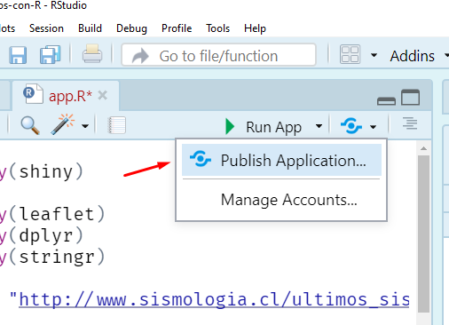

```{r setup, include=FALSE}
source("R/setup-xaringan.R")
```


```{r, child="readme.md"}
```

---

class: center, middle, inverse

# Repaso

---

# Repaso

- Una shiny app consta de dos partes:
  - `ui` (**u**ser **i**nterface) donde definiremos el lugar de los los `input`s que 
  el usuario podrá controlar, como también el lugar de donte estarán los `output`s que definamos.
  - `server` es donde definiremos la lógica de cada output que dependerán de los inputs.

--

<br>

- Los inputs de forma general son de la forma `tipoInput("nombreinput", parametros_del_input)`, por ejemplo
`sliderInput("valor", label = "Valor", min = 1, max = 10, value = 1)`.
- En el server accedo al valor del input como `input$nombreinput`. 

--

<br>

- Un output se define en la interfaz (gráfico, tabla, mapa, texto) con la forma `tipoOutput("nombreoutput")`, por ejemplo si quiero una salida/output tipo gráfico se usa `plotOutput("grafico")`
- Para enviar un grafico en el server se usa: `output$nombreoutput <- renderTipo({ codigo })`, por ejemplo:

`output$grafico <- renderPlot({ plot(rnorm(input$valor), type = "l") })`

---

# Repaso

Así una app sería:

```r
library(shiny)
library(bslib)
library(tidyverse)

ui <- page_fillable(
  sliderInput("valor", label = "Valor", min = 1, max = 10, value = 1),
  plotOutput("grafico"),
  ...
  )

server <- function(input, output) {
  output$grafico <- renderPlot({ 
    plot(rnorm(input$valor), type = "l")
  })
  ...
}

shinyApp(ui, server)
```

---

# Ejercicio: inputs + laytous + htmlwidgets


.pull-left[
Con la función `descargar_data` hacer una aplicación shiny que: 

- Use sidebar para para el layout general (`page_sidebar`) y mixto para los output (`layout_columns` + `card`).
- Incorpore un input para seleccionar una fecha (`dateInput`).
- Despliegue un mapa con los datos ({leaflet}).
- Muestre una tabla ({DT}).

]

.pull-right[
.code70[
```{r, eval=FALSE}
library(rvest)  
library(stringr)
library(lubridate)

descargar_data <- function(fecha = "20251118") {
  print(str_glue("descargando datos de {fecha}"))
  url <- format(
    ymd(fecha),
    "https://www.sismologia.cl/sismicidad/catalogo/%Y/%m/%Y%m%d.html"
  )
  datos <- read_html(url) |>
    html_table() |>
    dplyr::nth(2) |>
    janitor::clean_names() |>
    tidyr::separate(
      latitud_longitud,
      into = c("latitud", "longitud"),
      sep = " ",
      convert = TRUE
    ) 
  datos
} 
```
]]

---

# Ejercicio: inputs + laytous + htmlwidgets (solución)

.pull-left[.code70[
```{r, eval=FALSE}
library(shiny)
library(bslib)
library(highcharter)
library(leaflet)
library(DT)

library(rvest)  
library(janitor)
library(tidyverse)

descargar_data <- function(fecha = "20251118") {
 ...
}

ui <- page_sidebar(
  title = "Sismos",
  sidebar = sidebar(
    dateInput("fecha", "Seleccione fecha")
  ),
  layout_columns(
    card(leafletOutput("mapa")),
    card(DTOutput("tabla")),
    col_widths = 12
    )
  )

```
]]

.pull-right[.code70[
```{r, eval=FALSE}
server <-  function(input, output){
  
  output$mapa <- renderLeaflet({
    datos <- descargar_data(input$fecha)
    leaflet(datos) |>
      addTiles() |>
      addMarkers(
        lng = ~longitud, lat = ~latitud,
        popup = ~as.character(magnitud_2),
        label = ~as.character(`fecha_local_lugar`)
      ) |>
      addProviderTiles("Esri.WorldImagery")
  })
    
  output$tabla <- renderDataTable({
    descargar_data(input$fecha)
  })

}

shinyApp(ui, server)
```
]]


---

class: center, middle, inverse

# Temas

---

# Temas

.center[

]

---

# Temas


- Al principio todas nuestras app son similares, pues nos preocupamos en la funcionalidad.
- Existen paquetes y funciones que permiten cambiar el estilo de la aplicación.

<small>https://rstudio.github.io/bslib/articles/theming/index.html</small>

.center[

]

---

# Temas: aplicación para los ejemplos

Utilizaremos la aplicación que utilizamos para ejemplificar los _layouts_ (la distribución del contenido) con un pequeño cambio, utilizaremos {ggplot} para los gráficos:

.pull-left[
.code60[
```{r, eval=FALSE}
library(shiny)
library(bslib)
library(ggplot2)

datos <- rnorm(100)

ui <- page_sidebar(
  title = "Mi primera app",
  sidebar = sidebar(
    sliderInput("nrand", "Simulaciones", 
                min = 50, max = 100, value = 70),             
    selectInput("col", "Color", c("red", "blue", "black")),   
    checkboxInput("punto", "Puntos:", value = FALSE)
  ),
  navset_card_underline(
    title = "Resultados",
    nav_panel("Lineas", plotOutput("grafico")),
    nav_panel("Histograma", plotOutput("grafico2")),
    nav_panel("Tabla", tableOutput("tabla"))
  )
)
``` 
]
]


.pull-right[
.code60[
```{r, eval=FALSE}
server <- function(input, output) {
  output$grafico <- renderPlot({
    d <- data.frame(x = 1:input$nrand, y = head(datos, input$nrand))
    p <- ggplot(d, aes(x, y)) +
      geom_line(color = input$col)
    if(input$punto)
      p <- p + geom_point(color = input$col)
    p
  })
  
  output$grafico2 <- renderPlot({
    d <- data.frame(y = head(datos, input$nrand))
    ggplot(d, aes(y)) +
      geom_histogram(fill = input$col, color = "gray80")
  })
  
  output$tabla <- renderTable({
    x <- head(datos, input$nrand)
    data.frame(mean(x), sd(x), length(x))
  })
  
}

shinyApp(ui, server)
``` 
]
]

---

# Temas: bootswatch

Es los más fácil de implementar, sin impacto en código. Opciones en http://bootswatch.com/.

Esto se implementa con `theme = bs_theme(bootswatch = "cerulean")` dentro de la funcion `page_sidebar` o `page_fillable` por ejemplo.

.center[

]

---

# Temas: bootswatch (cont.)

Antes:

```{r, eval=FALSE}
library(shiny)
library(bslib)

ui <- page_sidebar(
  title = "Mi primera app",
  sidebar = sidebar(...
```

Ahora:

```{r, eval=FALSE}
library(shiny)
library(bslib)

ui <- page_sidebar(
  title = "Mi primera app", 
  theme = bs_theme(bootswatch = "minty") #<<
  sidebar = sidebar(...
```

Probar con temas como sketchy, simplex, etc. 

Notar que este cambio es solo en la parte `ui`, la parte del `server` no cambia.

---

# Temas: Incorporando propios estilos *bs_theme*

Con `bs_theme` un puede cambiar varios elementos estéticos de la aplicación.

En un principio, a modo de ejemplo, utilizaremos color de fondo, fuente, y tipografías de google para los _header_ y la aplicación. Pero se puede tener control de todos los elementos (`bs_theme_preview()`) 


```r
library(shiny)
library(ggplot2)
library(bslib)

ui <- page_sidebar(
  title = "Mi primera app", 
  theme = bs_theme(
    bg = "#FFFDD0",  # background: color de fondo
    fg = "#202A44",  # foreground: color de letra
    heading_font = font_google("Mouse Memoirs"),
    base_font = font_google("Uchen")
    ),
  sidebar = sidebar(...
```

---


# Temas: Incorporando propios estilos *bs_theme* (cont.)


.pull-left[
.code60[
```{r, eval=FALSE}
tema_nes <- bs_theme(
  bg = "#e5e5e5", fg = "#0d0c0c", primary = "#dd2020",
  base_font = font_google("Press Start 2P"),
  code_font = font_google("Press Start 2P"),
  "font-size-base" = "0.75rem", "enable-rounded" = FALSE
)

tema_santander <- bs_theme(
  version = 5,
  primary     = "#EC0000",   # Rojo Santander
  secondary   = "#F5F5F5",   # Gris claro
  bg          = "white",
  fg          = "#333333",
  base_font   = font_google("Roboto"),
  heading_font = font_google("Montserrat"),

  # Navbar del color primario
  navbar_bg   = "#EC0000",
  navbar_fg   = "white"
)
``` 
]
]


.pull-right[
.code60[
```{r, eval=FALSE}
tema_falabella <- bs_theme(
  version = 5,
  primary     = "#78BE20",   # Verde Falabella
  secondary   = "#4A4A4A",   # Gris oscuro
  bg          = "white",
  fg          = "#333333",
  base_font   = font_google("Lato"),
  heading_font = font_google("Nunito Sans"),

  # Navbar del color primario
  navbar_bg   = "#78BE20",
  navbar_fg   = "white"
)

tema_cencosud <- bs_theme(
  version = 5,
  primary     = "#005EB8",    # Azul Cencosud
  secondary   = "#F28C00",    # Naranjo corporativo
  bg          = "white",
  fg          = "#222222",
  base_font   = font_google("Inter"),
  heading_font = font_google("Poppins"),
  
  # Navbar del color primario
  navbar_bg   = "#005EB8",
  navbar_fg   = "white"
)

``` 
]
]


---

# Temas: Otros recuros

- https://unleash-shiny.rinterface.com/beautify-with-bootstraplib.html
- https://fonts.google.com/specimen/Mouse+Memoirs?query=Mouse+Memoirs
- https://www.colorhexa.com/FFFDD0


---

# Temas: Aplicando estilos a gráficos con {thematic} 

Como vimos, {shiny} cambia la tipografía de la UI, pero los gráficos no cambian solos.

Para solucionar eso, existe {thematic} (+ {ragg}). Con {thematic} los gráficos incorporarán las mismas reglas de estilo y colores que la aplicación.

```r
library(shiny)
library(bslib)
library(ggplot2)
library(ragg) # Activa renderizado moderno
library(thematic)

options(shiny.useragg = TRUE) # Obliga a Shiny a usar ragg para plotear
thematic_shiny(font = "auto") # Hace funcionar a thematic

ui <- page_sidebar(
  title = "Mi primera app", 
  theme = tema_custom,
  sidebar = sidebar(...
```

Más info en https://rstudio.github.io/thematic/.

---

class: center, middle, inverse

# Publicar tu app

---

# Publicar tu app

Existen varias formas simples/sencillas para compartir una aplicación. Es decir
que sea visible en otros dispositivos pc/móviles. Luego existen otras 
que requieren de mayor conocimiento técnico.

--

**Vía IP local**: Permite que tu pc sirva la aplicación y pueda ser visible en una red local 
(por ejemplo, la de tu casa), o también en una VPN.

--

**[shinyapps.io](https://shinyapps.io/)**: Permite que otro pc (una máquina virtual) sirva tu apliación y la exponga 
con una url pública. Ejemplo https://usuario.shinyapps.io/nombreapp.

--

**[shinylive](https://posit-dev.github.io/r-shinylive/)**: Paquete que permite crear aplicaciones Shiny que se ejecutan completamente en el navegador, sin necesidad de un servidor, utilizando WebAssembly a través del proyecto [webR](https://docs.r-wasm.org/webr/latest/).


--

**https://connect.posit.cloud**: Similar al servicio https://shinyapps.io, pero puede publicar otros frameworks pero requiere que el codigo esté en un repositorio.

--

**[shiny-server](https://posit.co/products/open-source/shiny-server/)**: Software que se puede instalar en tu propio servidor con juegos de azar.


---

# Publicar tu app: Vía IP local

Básicamente se obtiene la IP (_dirección de nuesto pc_) a través de una instrucción y luego se especifica correr la aplicación con dicha IP. Se deberá cambiar:

```r
# antes
shinyApp(ui = ui, server = server)

# despues
shinyApp(ui = ui, server = server, options = list(host = ip))
```
Donde `ip` es la IP del tu pc obtenida desde `ipconfig`:

```r
library(stringr)
ip <- str_extract(str_subset(system("ipconfig", intern=T), "IPv4"), "\\b(?:\\d{1,3}\\.){3}\\d{1,3}\\b")

ip <- "192.168.1.46"
```

✔️ Es simple de usar.

⚠️ Requiere que _nuestro_ pc esté encendido para que la app corra. Solamente funciona para redes locales (casa/trabajo) o tambien VPN.


---

# Publicar tu app: shinyapps.io

.pull-left[
- Básicamente sube todo lo que está en la carpeta de la aplicación archivos R y otros 
a una máquina virtual y detecta los paquetes utilizados.

- La versión gratuita tienes horas de uso que se van recuperando cada mes. Está
máquina virtual es humilde en términos de recursos, puede ser lenta dependiendo
del uso.


Primero se debe una cuenta en https://www.shinyapps.io/ (puedes asociar tu correo gmail).


✔️ Es simple de usar, amigable para principiantes.

⚠️ Plan gratuido recomendado para aplicacione simples. 

]


.pull-right[

]


---

# Publicar tu app: {shinylive}

El paquete shinylive ayuda a exportar tus aplicaciones Shiny desde archivos locales a un directorio que puede alojarse en un servidor web estático.


--

```r
# pak::pkg_install("posit-dev/r-shinylive")
library(shinylive)

# Crear un directorio de destino con el paquete {fs}
fs::dir_create("exported")

# Exportar la aplicación Shiny a un directorio con un html
shinylive::export("directorio_app/", "exported/")

# Para testear
httpuv::runStaticServer("exported/")
```

--

✔️ No requiere de un servido que aloje y sirva la aplicación.

⚠️ Cada vez que se accede se realiza la instalación de R en la pestaña del navegador. Y no siempre funciona por que no todos los paquetes están soportados. Pero sigue en desarrollo!


---

class: center, middle, inverse

# Shiny en Python

---

# Shiny en Python

.pull-left[
* https://shiny.posit.co/py/
* https://shiny.posit.co/py/gallery/
* https://shinylive.io/py/examples/#app-with-plot
* https://shinylive.io/r/examples/


En Terminal/CMD:

```
# Python 3.12.10
pip install shiny numpy matplotlib pandas Jinja2
python -m shiny run --reload app.py
```
]

.pull-right[
```python
# app.py
from shiny import App, ui, render
import matplotlib.pyplot as plt
import numpy as np

app_ui = ui.page_sidebar(  
    ui.sidebar(
        ui.input_slider("n", "N", 0, 100, 20),
        bg="#f8f8f8" 
    ),
    ui.output_plot("histogram")
)  

def server(input, output, session):
    
    @render.plot(alt="A histogram")
    def histogram():
        np.random.seed(19680801)
        x = 100 + 15 * np.random.randn(437)
        plt.hist(x, input.n(), density=True)

app = App(app_ui, server)
```
]


